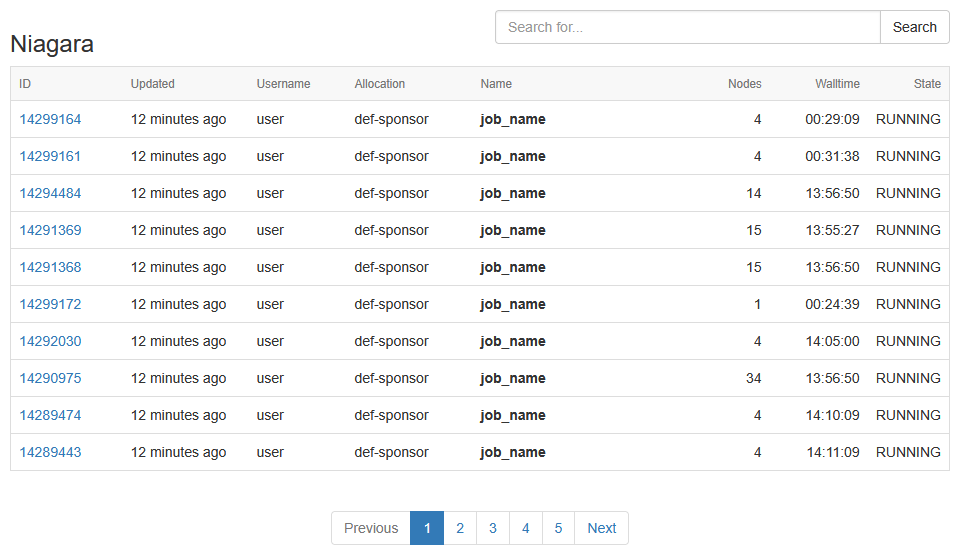

User portals
============

`Français <../../fr/monitoring/user-portal.html>`_

Some clusters offer a portal to monitor your current jobs and even your
recently completed jobs. Here they are:

- **Béluga** : https://portail.beluga.calculquebec.ca
- **Narval** : https://portail.narval.calculquebec.ca
- **Niagara** : https://my.scinet.utoronto.ca

In all cases, you must log in with your `CCDB <https://ccdb.alliancecan.ca>`__
portal credentials.

Narval job statistics
---------------------

In the Narval portal (or the Béluga portal), a table listing your most recent
jobs can be found on the `Job stats
<https://portail.narval.calculquebec.ca/secure/jobstats/>`__ page, in the
*Your jobs* section.

.. figure:: ../../images/portal-tasks-table-narval_en.png

Clicking on one of the job identifiers takes you to a page displaying all
`available information about the job
<https://docs.alliancecan.ca/wiki/Portail#Page_d'une_t%C3%A2che_CPU>`__
(at the time of writing, the wiki page is only available in French):

- The loaded modules, if any.
- If applicable, one or more diagnostic messages giving suggestions for
  improving the job script.
- A button to view the job script.
- A button to view the job submission command.
- The job history.
- A summary table of the resources requested.
- A complete analysis of resources used (if measured) over time:

  - CPU usage. In the figure below, 8 of the 12 cores requested for the job are
    100 % utilized.

    .. figure:: ../../images/portal-cpu-core-usage_en.png

  - Memory usage.
  - Number of processes and threads. In the figure below, we see four (4)
    processes each using two (2) ``gmx`` threads, so 8 running threads.

    .. figure:: ../../images/portal-processes-and-threads.png

  - The network file system usage.
  - Shared resources of the compute node:

    - Ethernet and Infiniband bandwidth.
    - Local storage usage (number of operations, bandwidth, total usage).
    - Electrical power used.

For more images and more information, see the `documentation section here
<https://docs.alliancecan.ca/wiki/Portail#Statistiques_des_t%C3%A2ches>`__
(at the time of writing, the wiki page is only available in French).

Statistiques des tâches sur Niagara
-----------------------------------

Dans le portail de Niagara, un tableau listant vos
dernières tâches se trouve dans la page
`Tâches -> Niagara <https://my.scinet.utoronto.ca/jobs/niagara>`_.

En cliquant sur l'un des numéros de tâche, on accède à une page affichant
toutes les informations disponibles au sujet de la tâche :

- L'historique de la tâche.
- Une analyse complète des ressources utilisées (si mesurées) selon le temps :

  - Utilisation moyenne des processeurs par nœud. Dans la figure ci-dessous,
    chaque point de couleur correspond à l'un des 14 nœuds réservés pour la
    tâche.

    .. figure:: ../../images/portal-niagara-node-usage_en.png

  - Mémoire disponible.
  - Débit en lecture des données.
  - Débit en écriture des données. Dans la figure ci-dessous, on remarque les
    sauvegardes effectuées régulièrement. Ce sont possiblement des
    `points de contrôle <https://docs.alliancecan.ca/wiki/Points_de_contr%C3%B4le/fr>`_.

    .. figure:: ../../images/portal-niagara-write-bw_en.png

  - Opérations sur les fichiers.
  - etc.

- Le script de tâche.
- Les variables d'environnement de la tâche en cours.
