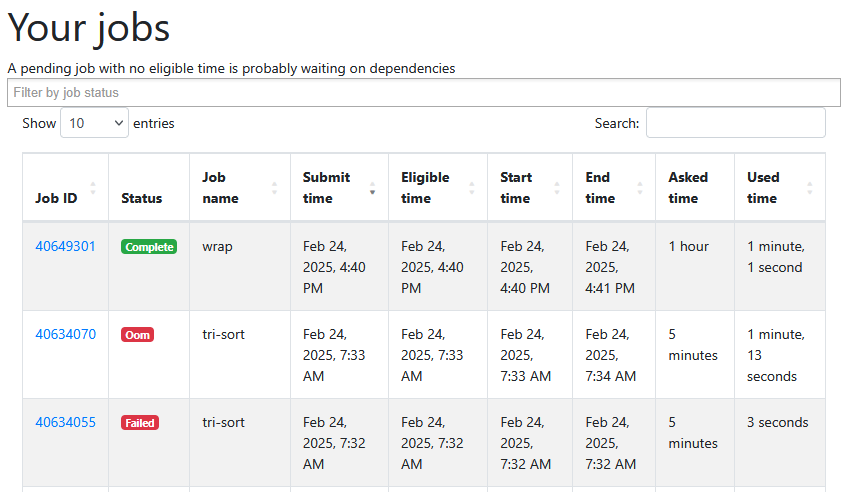
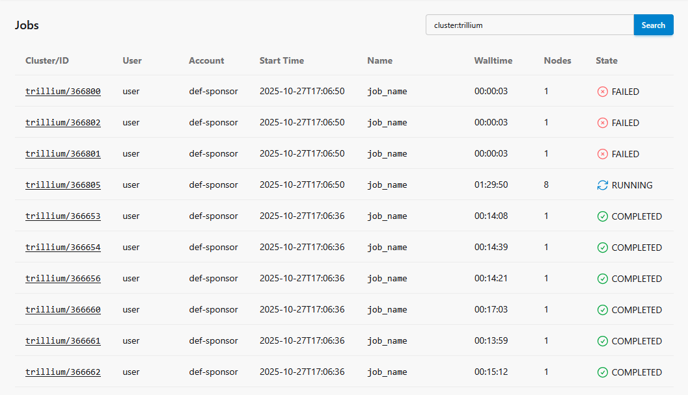

User portals
============

`Français <../../fr/monitoring/user-portal.html>`_

Some clusters offer a portal to monitor your current jobs and even your
recently completed jobs. Here they are:

- **Narval**: https://portail.narval.calculquebec.ca
- **Rorqual**: https://metrix.rorqual.calculquebec.ca
- **Trillium and Trillium GPU**: https://my.scinet.utoronto.ca

In all cases, you must log in with your `CCDB <https://ccdb.alliancecan.ca>`__
portal credentials.

.. note::

    Following the `2025 infrastructure renewal
    <https://docs.alliancecan.ca/wiki/Infrastructure_renewal>`__, not all
    clusters have a user portal already. New portals and functionalities will
    be added progressively.

Narval job statistics
---------------------

In the Narval portal (or the Rorqual portal), a table listing your most recent
jobs can be found on the `Job stats
<https://portail.narval.calculquebec.ca/secure/jobstats/>`__ page, in the
*Your jobs* section.

Clicking on one of the job identifiers takes you to a page displaying all
`available information about the job
<https://docs.alliancecan.ca/wiki/Metrix/en#CPU_task_page>`__:

- The loaded modules, if any.
- If applicable, one or more diagnostic messages giving suggestions for
  improving the job script.
- A button to view the job script.
- A button to view the job submission command.
- The job history.
- A summary table of the requested resources.
- A complete analysis of resources used (if measured) over time:

  - CPU usage. In the figure below, 8 of the 12 cores requested for the job are
    100 % utilized.

    .. figure:: ../../images/portal-cpu-core-usage_en.png

  - Memory usage.
  - Number of processes and threads. In the figure below, we see four (4)
    processes each using two (2) ``gmx`` threads, so 8 running threads.

    .. figure:: ../../images/portal-processes-and-threads.png

  - The network file system usage.
  - The compute node’s shared resources:

    - Ethernet and Infiniband bandwidth.
    - Local storage usage (number of operations, bandwidth, total usage).
    - Electrical power used.

For more images and information, see the `documentation section here
<https://docs.alliancecan.ca/wiki/Metrix/en#Task_statistics>`__.

Trillium job statistics
-----------------------

In the SciNet portal, your latest jobs are categorized by cluster:

- Trillium (CPU) : https://my.scinet.utoronto.ca/jobs/?q=cluster:trillium
- Trillium GPU : https://my.scinet.utoronto.ca/jobs/?q=cluster:trillium-gpu

Clicking on one of the job identifiers takes you to a page displaying all
available information about the job:

- The job history.
- A complete analysis of resources used (if measured) over time:

  - Average CPU utilization per node. In the figure below, each colored dot
    corresponds to one of the 8 nodes reserved for the job.

    .. figure:: ../../images/portal-trillium-node-usage_en.png

  - Available memory.
  - Floating point operations per second.
  - Data throughput in memory.
  - Data transmitted via Infiniband.
  - etc.

- The job script.
- The environment variables of the running job.
