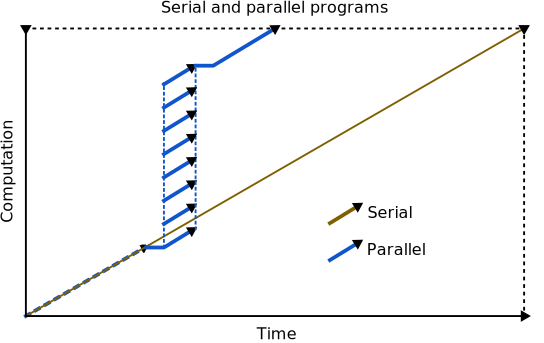

CPU cores
=========

`Français <../../fr/resources/cpu.html>`_

CPU cores are a resource very different from time or memory. For parallel
jobs, one must of course choose a number of cores. However, for both serial and
parallel tasks, it is important to verify that the CPU is properly utilised.

..
    Les cœurs CPU sont une ressource analysée diféremment du temps ou de la
    mémoire. Pour les tâches parallèles, il faut bien sûr choisir un nombre de
    cœurs. Toutefois, aussi bien pour les tâches sérielles que parallèles, il
    importe de vérifier que le CPU est bien utilisé.

Why check CPU usage?
--------------------

- The CPU cores allocated to a job are not constantly performing computations:
  they are sometimes waiting for data from a file, for a reply to a network
  communication, etc.
- If this wait time is important, the CPU cores are underused.
- Fixing this problem accelerates your program and avoids wasting resources,
  increasing your tasks’ priority.

..
    - Les cœurs CPU alloués à une tâche ne sont pas constamment en train de
      calculer : ils attendent parfois d’obtenir les données d’un fichier, une
      réponse à une communication réseau, etc.
    - Si ce temps d’attente est important, les cœurs CPU sont sous-utilisés.
    - Régler ce problème accélère votre programme et évite le gaspillage de
      ressources, augmentant la priorité de vos tâches.

Checking CPU usage
------------------

The CPU usage in a completed job can be checked with ``seff``. For instance:

.. code-block:: console
    :emphasize-lines: 1,6-10

    [alice@narval3 ~]$ seff 39732872
    Job ID: 39732872
    Cluster: narval
    User/Group: alice/alice
    State: COMPLETED (exit code 0)
    Nodes: 1
    Cores per node: 12
    CPU Utilized: 00:51:04
    CPU Efficiency: 70.71% of 01:13:24 core-walltime
    Job Wall-clock time: 00:06:07
    Memory Utilized: 270.59 MB
    Memory Efficiency: 8.81% of 3.00 GB

Where *CPU Utilized* is the total CPU time used by all cores and *Job Wall-clock
time* is the real elapsed time. This job’s CPU usage is 70.71 %. This means that
close to 30 % of the available CPU time was unused! ``seff`` computes the usage
(:math:`U`) for :math:`n` cores as:

..
    Où *CPU Utilized* est le temps CPU total utilisé par tous les cœurs et *Job
    Wall-clock time* le temps réel. L’utilisation CPU de cette tâche est de
    70,71 %. Cela signifie que près de 30 % du temps CPU potentiel a été
    inutilisé ! ``seff`` calcule l’utilisation (:math:`U`) pour :math:`n` cœurs
    CPU ainsi :

.. math::

    U = \frac{t_\text{CPU}}{t_\text{real}\;n}

The raw values needed for this calculation can be queried with ``sacct``.
For instance:

..
    Les valeurs brutes nécessaires à ce calcul peuvent aussi être affichés
    avec ``sacct``. Par exemple :

.. code-block:: console
    :emphasize-lines: 1,4

    [alice@narval3 ~]$ sacct -j 39732872 -o JobID%15,JobName,Elapsed,TotalCPU,NCPUs
              JobID    JobName    Elapsed   TotalCPU      NCPUS 
    --------------- ---------- ---------- ---------- ---------- 
           39732872     gmx-md   00:06:07  51:04.301         12 
     39732872.batch      batch   00:06:07  00:01.043         12 
    39732872.extern     extern   00:06:07  00:00.001         12 
         39732872.0        gmx   00:06:05  51:03.255         12

.. note::

    The ``%15`` characters set the column’s width.

A CPU usage lower than 90 % is a red flag. Does your program spend a lot of time
reading files rather than computing? Is there inefficient communication between
the CPU cores allocated to a parallel job? To investigate:

..
    Si l’utilisation CPU est inférieure à 90 %, il convient de se poser des
    questions. Votre programme passe-t-il beaucoup de temps à lire des fichiers
    plutôt qu’à calculer ? Y a-t-il une communication inefficace entre les cœurs
    CPU alloués à une tâche parallèle ? Pour le vérifier :

* Reduce the number of CPU cores if the job is parallel.
* Optimise storage access by reading files from `node-local storage
  <https://docs.alliancecan.ca/wiki/Using_node-local_storage/en>`_ rather than
  a network filesystem (``/home``, ``/project``, ``/scratch``). Your jobs
  have access to a temporary local directory in ``$SLURM_TMPDIR``.

..
    * Réduisez le nombre de cœurs CPU s’il s’agit d’une tâche parallèle.
    * Optimisez les accès au stockage en lisant les fichiers à partir du
      `stockage local sur les nœuds de calcul
      <https://docs.alliancecan.ca/wiki/Using_node-local_storage/fr>`_ plutôt
      qu’à partir d’un système de fichiers réseau (``/home``, ``/project``,
      ``/scratch``). Vos tâches ont accès à un répertoire temporaire local dans
      ``$SLURM_TMPDIR``.

.. warning::

    In ``seff``’s output, CPU usage is called *CPU Efficiency*. However, this
    measure has nothing to do with a parallel program’s *efficiency*, which
    relates to its :ref:`scalability <scalability>`, as discussed in later
    sections.

    ..
        Dans la sortie de ``seff``, l’utilisation CPU est appelée *CPU
        Efficiency*. Toutefois, cette mesure est distincte de l’*efficacité*
        d’un programme parallèle, qui est une mesure de sa :ref:`scalabilité
        <scalability>`, tel que discuté dans les sections suivantes.

Exercise
''''''''

#. List your recent jobs with ``sacct -X``.
#. Try ``seff <jobid>`` for one of these jobs and check its CPU usage.
#. Try ``sacct -j <jobid> -o JobID,JobName,Elapsed,TotalCPU,NCPUs`` for the same
   task.

Why optimise the number of CPU cores?
-------------------------------------

- Your parallel program will compute faster if more CPU cores are allocated to
  the job.
- However, the performance of a parallel program does not increase indefinitely
  as more cores are added.
- In addition, jobs that require more cores wait longer in the queue and
  consume more resources, lowering your jobs’ priority.
- An optimal number of CPU cores balances these opposite effects. It minimises
  the total time (wait and calculation) needed for your jobs and avoids wasting
  resources.

.. _scalability:

Scalability
-----------

A program’s `scalability <https://docs.alliancecan.ca/wiki/Scalability/en>`_ is
its capacity to reduce computing time as it uses more CPU cores. For instance,
using two CPU cores rather than one should, ideally, halve the computing time,
while using four should reduce that time to 1/4 of that required with a single
core.

..
    La `scalabilité <https://docs.alliancecan.ca/wiki/Scalability/fr>`_ est la
    capacité d’un programme parallèle à réduire le temps de calcul à mesure
    qu’il utilise plus de cœurs CPU. Par exemple, idéalement, utiliser deux
    cœurs CPU plutôt qu’un seul réduirait de moitié le temps de calcul et en
    utiliser quatre réduirait ce temps à 1/4 du temps requis avec un seul cœur.

In reality, however, parallel programs have limitations. As they use more cores,
the gain in time diminishes and, eventually, becomes negligible. Some programs
and algorithms are more scalable than others. In addition, scalability varies as
a function of certain parameters, such as input data size.

..
    En réalité, toutefois, les programmes parallèles ont leurs limites. À mesure
    que l’on utilise plus de cœurs CPU, le gain de temps diminue et devient
    éventuellement négligeable. Certains programmes et algorithmes ont une
    meilleure scalabilité que d’autres. De plus, la scalabilité varie en
    fonction de certains paramètres tels que la taille des données d’entrée.

Scalability is quantified with two quantities: speedup and efficiency. For
:math:`n` CPU cores, speedup (:math:`S`) is the ratio of serial computing time
to parallel computing time:

..
    On quantifie la scalabilité avec deux grandeurs : l’accélération et
    l’efficacité. Pour :math:`n` cœurs CPU, l’accélération (*speedup*, :math:`S`)
    est le ratio du temps d’exécution sériel sur le temps d’exécution parallèle :

.. math::

    S_n = \frac{t_\text{serial}}{t_n}

For instance, if a calculation requires 10 minutes with 1 CPU cores and 6
minutes with 2, acceleration is 1.67. It is a measure of “how many times faster
the program is”.

..
    Par exemple, si un calcul requiert 10 minutes avec 1 cœur CPU et 6 minutes
    avec 2, l’accélaration est de 1,67. C’est donc une mesure de « combien de
    fois plus rapide est le programme ».

Efficiency (:math:`E`) is the ratio of speedup to number of CPU cores:

..
    L’efficacité (*efficiency*, :math:`E`) est le ratio de l’accélération sur le
    nombre de cœurs CPU :

.. math::

    E_n = \frac{S_n}{n}

Continuing the above example, a speedup of 1.67 for 2 CPU cores gives a 0.835
efficiency (83.5 %). An efficiency of 100 % is called linear scaling. When the
efficiency drops under 75 %, the number of CPU cores should typically be
reduced.

..
    Poursuivant l’exemple ci-dessus, une accélération de 1,67 pour 2 cœurs CPU
    donne une efficacité de 0,835 (83,5 %). Une efficacité de 100 % est
    qualifiée de linéaire. Lorsque l’efficacité tombe sous 75 %, on devrait
    généralement diminuer le nombre de cœurs utilisés.

In the following example of a program’s scalability (see figure below), there is
an inflection point at 256 cores: efficiency drops rapidly past this point.

..
    Dans cet exemple de scalabilité d’un programme parallèle (voir figure
    ci-dessous), on remarque un point d’inflection à 256 cœurs : l’efficacité
    diminue rapidement passé ce point.

.. figure:: ../../images/gmx-scaling_en.svg

In this example, performance (:math:`P`) is used rather than computing time
(:math:`t`) to show scalability. The two approaches are equivalent, with
performance simply having the inverse dimension (:math:`t^{-1}`). Performance
is expressed in a problem-specific unit: steps per second, number of images or
molecules processed per hour, simulated trajectory length per day, etc. Speedup
can be calculated from performance rather than computing time:

..
    Dans cet exemple, on utilise la performance (:math:`P`) plutôt que le temps
    de calcul (:math:`t`) pour illustrer la scalabilité. Les deux approches sont
    équivalentes, la performance ayant simplement une dimension inverse
    (:math:`t^{-1}`). La performance est exprimée avec une unité qui sied au
    problème : étapes de calcul par seconde, nombre d’images ou de molécules
    traitées par heure, durée de trajectoire simulée par jour, etc.
    L’accélération peut être calculée à partir de la performance plutôt que du
    temps de calcul :

.. math::

    S_n = \frac{P_{n}}{P_\text{serial}}

.. _scalability-exercise:

Exercise
''''''''

**Objectives**

- Analyse a parallel job’s scalability.
- Determine the optimal number of CPU cores to use for this job.

**Instructions**

#. Go to the exercise directory with ``cd
   ~/cq-formation-cip201-main/lab/gmx-scaling``.
#. Prepare the input files with ``bash gmx-prepare.sh``.
#. Edit the job script with ``nano gmx-job.sh``. Ask for 1, 2, 4, or 8 CPU cores
   with the ``--cpus-per-task`` option.
#. Submit the job.
#. Once the job has completed, get the program’s performance with ``grep
   ^Performance slurm-<jobid>.out``.
#. Change the number of requested CPU cores and repeat the job. (Do not prepare
   the input files again.)
#. Fill the table in ``gmx-scaling.txt``.

   #. Note the measured performance in the :math:`P` (ns/day) column.
   #. Calculate speedup :math:`S` and efficiency :math:`E` (%) for 2, 4, and 8
      cores.
   #. How many CPU cores would you use for similar jobs?

.. note::

    This job computes the interactions in a periodic box containing 216 water
    molecules (648 atoms, see figure below) with GROMACS, a software for
    biomolecular simulations.

    .. figure:: ../../images/water-box.png
        :width: 320px

    The program’s authors report that it is scalable until around 50 atoms per
    CPU core. Below this value, performance no longer increases even if more
    cores are used. However, efficiency decreases long before reaching this
    limit!

    In practice, biomolecular simulations process much bigger systems, often in
    the order of hundreds of thousands of atoms. The parallel programs that
    simulate these systems are efficient even with hundreds of CPU cores.

Why isn’t scaling linear?
'''''''''''''''''''''''''

Scalability is limited by the fraction of the program that computes in parallel
(see figure below). This is referred to as
`Amdahl’s law <https://en.wikipedia.org/wiki/Amdahl%27s_law>`_. A parallel
program can have a serial fraction for a variety of reasons:

- Reading an input file or updating an output file in a non-parallel manner.
- Pre- or post-processing data before or after applying a parallel algorithm.
- A non-parallel intermediate calculation step.

In addition, the time required for the threads of execution to communicate
lowers efficiency. In general, the larger a problem is, the better it scales.

For all these reasons, the only way to accurately determine the optimal number
of CPU cores for a parallel job is to perform a scalability analysis (see the
above :ref:`exercise <scalability-exercise>`) and to repeat it every time your
job’s parameters or the size of your input data change significantly.

.. note::

    A distinction is made between strong scaling and week scaling.

    - Strong scaling is how computing time varies as a function of the number of
      CPU cores for a problem whose *total* size is constant. Ideally, computing
      time is inversely proportional to the number of CPU cores.
    - Weak scaling is how computing time varies as a funcion of the number of
      CPU cores for a problem whose size *per CPU core* is constant. Ideally,
      computing time stays constant.
    
.. warning::

    Again, a parallel program’s efficiency is not the same measure as its CPU
    usage. The measure called *CPU efficiency* in the output of the ``seff``
    command is actually CPU usage and is not a measure of a program’s
    scalability: ``seff`` cannot guess the performance of a parallel program and
    analyse it automatically!
