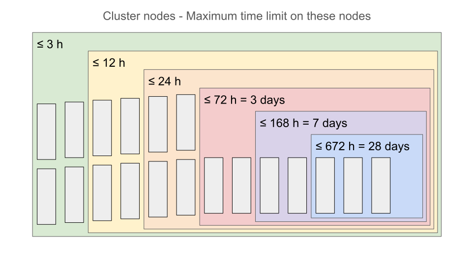

Time
====

`Français <../../fr/resources/time.html>`_

Why set a time limit?
---------------------

- To facilitate their maintenance, all the national clusters set a maximum time
  limit for jobs, typically seven days (with exceptions).
- The longer a job runs, the more likely it is to be interrupted, such as by a
  hardware failure.

  - `Checkpoints <https://docs.alliancecan.ca/wiki/Points_de_contr%C3%B4le/en>`_
    protect against this issue and also allow splitting a long job into many
    shorter, successive ones.

- Most jobs finish in a matter of hours.
- Consequently, our `scheduling policies
  <https://docs.alliancecan.ca/wiki/Job_scheduling_policies#Percentage_of_the_nodes_you_have_access_to>`_
  make more nodes available for short jobs.
  

- Your jobs’ wait time depends on how many nodes are eligible to serve them
  according to the time you requested.

In conclusion, **it is in your best interest to ask only for the computing time
you actually need**, with of course a safety margin (such as 20 % of the
expected time).

Assessing computing time using your computer
--------------------------------------------

When you guess a time based on your experience with a software on your
personal computer, you need to take these factors into account:

#. Your **processor**’s speed: the CPU cores on the compute cluster are not
   necessarily faster than those on your computer.
#. Your computer’s **memory** speed.
#. Your computer’s **storage** speed when reading and writing data.

For a similar calculation on the cluster, a good strategy is to **ask for twice
the time measured on your computer, then adjust as needed**.

Checking the computing time on the cluster
------------------------------------------

- If you know the id of the completed job, use ``seff <jobid>`` or ``sacct -j
  <jobid> -o JobID,JobName,Elapsed``.

  - ``Elapsed`` : elapsed time between the start and the end of the job.
  - See
    `our documentation <https://docs.alliancecan.ca/wiki/Running_jobs#Completed_jobs>`_.

- If you do not know the job id, list your recent jobs with ``sacct -X``.

  - Option ``-X,--allocations`` filters the list to show only resource
    allocations as opposed to job steps (which we will see in a later chapter).
  - To start the search from an `earlier date
    <https://slurm.schedmd.com/sacct.html#OPT_starttime>`_: ``-S <YYYY-MM-DD>``
    or ``--starttime=<YYYY-MM-DD>``.
  - To end the search after a `specific date
    <https://slurm.schedmd.com/sacct.html#OPT_endtime>`_: ``-E <YYYY-MM-DD>`` or
    ``--endtime=<YYYY-MM-DD>``.

Exercise
''''''''

#. List your recent jobs with ``sacct -X``.
#. Try ``seff <jobid>`` for one of these jobs to check the elapsed time.
#. Check the elapsed time with
   ``sacct -j <jobid> -o JobID,JobName,Elapsed``.

Estimating the time required for a larger calculation
-----------------------------------------------------

A program’s main algorithm has a certain complexity order:

- Linear, :math:`O(n)`, meaning that processing **2x** the amount of data
  (:math:`n`) requires **2x** the time.
- Quadratic, :math:`O(n^2)`, meaning that processing **2x** :math:`n` requires
  **4x** the time.
- Cubic, :math:`O(n^3)`, meaning that processing **2x** :math:`n` requires
  **8x** the time.
- Etc.

A program’s trend with regards to processing different amounts of data can be
verified empirically. To measure execution time, a command can be prefixed with
``time -p``:

.. code-block::

    time -p ./prog arg1 ...

Once ``prog`` has finished, ``time`` displays three time values in seconds:

- ``real``: the actual elapsed time, **this is the one to consider**.
- ``user``: the effective time ``prog`` used the CPU cores.
- ``sys``: the time spent in operating system calls (such as accessing a file).

In this workshop, we will only use the ``real`` time.

Exercice
''''''''

`Sorting algorithms <https://en.wikipedia.org/wiki/Sorting_algorithm>`_ have
different complexity orders. If :math:`n` is the number of values to sort, some
algorithms, such as how we intuitively sort playing cards, have an
:math:`O(n^2)` order, while others have an :math:`O(n\log(n))` order and are
thus much faster as the amount of data increases.

#. Go to the exercise directory with
   ``cd ~/cq-formation-cip201-main/lab/sort``.
#. Compile the ``bubble`` and ``quick`` programs with the ``make`` command.
#. Edit ``test.sh`` to add ``time -p`` before the ``./bubble`` and ``./quick``
   commands.
#. Submit ``test.sh`` as a job.
#. Once the job has completed, inspect the ``real`` time values measured for
   both sorting algorithms and different amounts of data (in parenthesis). These
   results with be in the output file ``slurm-<jobid>.out``.
