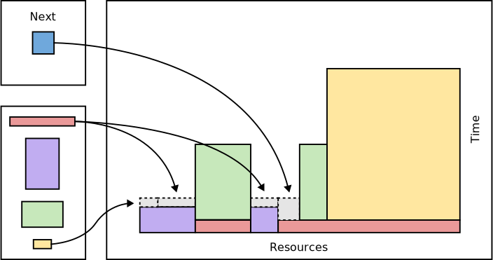

General information
===================

`Français <../../fr/slurm/intro.html>`_

Reminder of job scheduling
--------------------------

* Starting compute tasks on a cluster is not immediate as it is on a local
  computer.

  * The compute tasks, encapsulated in *jobs*, are queued. These pending jobs
    are constantly sorted by priority until the requested resources are
    available.
  * This is all due to the high demand for computing resources.

* Depending on the priority of each job and the resources that become
  available, the Slurm scheduler plays a kind of `Tetris
  <https://en.wikipedia.org/wiki/Tetris>`__ where the width of the blocks
  corresponds to a quantity of resource requested and where the height of a
  block is the time requested for the job.

  * What is special is that the actual computation time is usually shorter than
    the requested time and some parallel computation blocks can be split into
    several pieces.

As a cluster user, you will therefore have to submit jobs using commands,
options and job scripts. The jobs will eventually be executed automatically.
