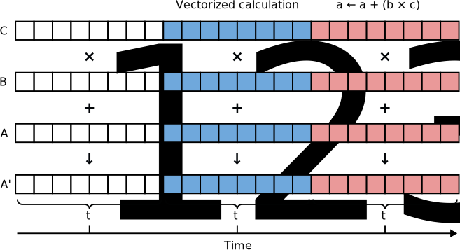

Parallel jobs
=============

`Français <../../fr/task-types/parallel.html>`_

Parallel jobs are those that use more than one CPU core. Their purpose is to
reduce computing time. To do so, a parallel program decomposes calculations
using a parallel algorithm, that is to say it breaks down the computation into
sub-computations that can be performed simultaneously (see figure below).

Parallel programs are run on clusters in different ways. The following sections
cover :ref:`multi-threaded programs <para-multi-threading>` and :ref:`MPI
programs<para-mpi>`, two frequently used schemes. A more complex case,
:ref:`nested parallelism <para-nested>`, is then presented, before a short
discussion of :ref:`other parallelism types <para-others>`.

When you use a parallel program for the first time on our clusters, check the
`Alliance Technical Documentation
<https://docs.alliancecan.ca/wiki/Technical_documentation/en>`_ before anything
else. We explain how to run a variety of scientific programs, including job
script examples. Do not hesitate to contact our `technical support
<https://docs.alliancecan.ca/wiki/Technical_support/fr>`_ if you have any
questions.

.. _para-multi-threading:

Multi-threaded programs
-----------------------

These programs use multiple threads of execution. Each thread uses one CPU core.
Threads of execution exist inside the process and share the same memory space,
which they use to communicate:

Compute jobs that use a multi-threaded program are limited to a single compute
node since all threads of execution exist inside a single process. (We will see
later that :ref:`MPI programs <para-mpi>` can use more than one compute node.)

Identifying a multi-threaded program
''''''''''''''''''''''''''''''''''''

Look for these keywords in your program’s documentation:

- Multi-threading
- OpenMP: a standard for multi-threaded programming
- Intel MKL threads: a numerical library with support for multi-threading
- Intel Thread Building Blocks (TBB): a library for multi-threaded programming
- pthreads: a library for multi-threaded programming
- Shared memory: refers to the communication strategy used by multi-threaded
  programs

Multi-threaded programs can also be identified by their behaviour in the task
manager. In ``top -u $USER``, an entry for an intensive multi-threaded program
shows a CPU usage over 100 % (around 100 % times the number of cores used):

.. code-block:: console
    :emphasize-lines: 2

      PID UTIL.     PR  NI    VIRT    RES    SHR S  %CPU  %MEM    TEMPS+ COM.
    65829 alice     20   0   20272   6896   3296 R 796,1   0,0   1:39.15 mt-prog
    66465 alice     20   0   22528   3088   1344 R   1,1   0,0   0:00.03 top
    64485 alice     20   0   24280   5704   2088 S   0,0   0,0   0:00.04 bash
    65900 alice     20   0  192996   2968   1032 S   0,0   0,0   0:00.01 sshd
    65901 alice     20   0  127588   3544   1796 S   0,0   0,0   0:00.02 bash

With ``top -u $USER -H`` (or the :kbd:`Shift+h` keyboard shortcut), there is one
entry for each thread of execution:

.. code-block:: console
    :emphasize-lines: 2-9

      PID UTIL.     PR  NI    VIRT    RES    SHR S  %CPU  %MEM    TEMPS+ COM.
    65829 alice     20   0   20272   6896   3296 R  99,9   0,0   1:39.15 mt-prog
    65830 alice     20   0   20272   6896   3296 R  99,9   0,0   1:39.15 mt-prog
    65831 alice     20   0   20272   6896   3296 R  99,9   0,0   1:39.15 mt-prog
    65832 alice     20   0   20272   6896   3296 R  99,9   0,0   1:39.15 mt-prog
    65833 alice     20   0   20272   6896   3296 R  99,1   0,0   1:39.15 mt-prog
    65834 alice     20   0   20272   6896   3296 R  99,1   0,0   1:39.15 mt-prog
    65835 alice     20   0   20272   6896   3296 R  95,0   0,0   1:39.15 mt-prog
    65836 alice     20   0   20272   6896   3296 R  95,0   0,0   1:39.15 mt-prog
    66465 alice     20   0   22528   3088   1344 R   1,1   0,0   0:00.03 top
    64485 alice     20   0   24280   5704   2088 S   0,0   0,0   0:00.04 bash
    65900 alice     20   0  192996   2968   1032 S   0,0   0,0   0:00.01 sshd
    65901 alice     20   0  127588   3544   1796 S   0,0   0,0   0:00.02 bash

Requesting appropriate resources
''''''''''''''''''''''''''''''''

Here is a minimal script for a parallel job that uses a multi-threaded program:

.. code-block:: bash
    :emphasize-lines: 4-6

    #!/bin/bash

    #SBATCH --job-name=my-multi-threaded-job
    #SBATCH --ntasks=1
    #SBATCH --cpus-per-task=8
    #SBATCH --mem-per-cpu=1G
    #SBATCH --time=4:00:00
    #SBATCH --account=def-sponsor

    ./multi-threaded-prog

In this context, ``--ntasks`` is to the number of processes to start.
Multi-threaded programs use a single process. The ``--cpus-per-task`` option is
the number of CPU cores that the process uses, which corresponds to the number
of threads of execution.

Programming tools for multi-threading use different options to control the
number of threads of execution. For instance, OpenMP programs use the
``OMP_NUM_THREADS`` environment variable. In a job script, this variable is set
to the number of CPU cores requested from the scheduler:

.. code-block:: bash
    :emphasize-lines: 5,10

    #!/bin/bash

    #SBATCH --job-name=my-multi-threaded-job
    #SBATCH --ntasks=1
    #SBATCH --cpus-per-task=8
    #SBATCH --mem-per-cpu=1G
    #SBATCH --time=4:00:00
    #SBATCH --account=def-sponsor

    export OMP_NUM_THREADS=${SLURM_CPUS_PER_TASK:-1}

    ./openmp-prog

The ``:-1`` syntax uses the value ``1`` if ``SLURM_CPUS_PER_TASK`` is unset.

Exercise
''''''''

**Objectives**

- Determine the necessary options for a multi-threaded job.
- Check the behaviour of a multi-threaded program with ``top``.

**Instructions**

#. Go to the exercise directory with ``cd
   ~/cq-formation-cip201-main/lab/pi-multi-threaded``.
#. Compile the ``pi`` program with the ``make`` command.
#. Start an interactive job with ``salloc [...] --time=00:10:00``. Remplace
   ``[...]`` by the parallelism options necessary for a multi-threaded job and
   ask for 2 CPU cores.
#. Run the program in the background with ``./pi 10000000000 &`` (10
   billion points, that is one followed by 10 zeros).
#. While ``pi`` runs, check its CPU usage with ``top -u $USER`` and ``top -u
   $USER -H``.

.. note::

    The program used in this exercise computes the number :math:`π` (pi), the
    ratio of a circle’s circumference to its diameter. To do so, we generate a
    large number of points at random in an arbitrary square. For
    each point, we then check if it is inside an inscribed circle.
    
    .. figure:: ../../images/circle.svg
        :width: 94px

    The ratio of the number of points inside the inscribed circle (:math:`p`) to
    the total number of points (:math:`n`) is also the ratio of the circle’s
    surface to the square’s:

    .. math::
    
        \frac{πr^2}{(2r)^2} = \frac{p}{n} \quad → \quad π = \frac{4p}{n}

    Precisely estimating :math:`π` using this so-called Monte Carlo method
    requires a great number of random points. To accelerate the calculation, we
    decompose it: the points to generate are distributed among the CPU cores
    allocated to the job. With 2 cores, each one generates half the points,
    which doubles the speed.

    This algorithm is an example of so-called “trivial” parallelism since it
    requires almost no communication: each CPU core (:math:`i`) generates random
    points independently and counts how many are inside the inscribed circle
    (:math:`p_i`). These values are then added to give :math:`p`.

    You can read the program’s source code in ``pi.c``.

.. _para-mpi:

MPI programs
------------

MPI (Message Passing Interface) programs create multiple processes. Each process
has one thread of execution and uses one CPU core. Each process has its own
memory space and communicates with the others by exchanging messages:

Compute jobs that run an MPI program can use multiple compute nodes since the
processes can exchange messages through the network interconnecting the nodes.

Identifying an MPI program
''''''''''''''''''''''''''

Look for these keywords in your program’s documentation:

- Message Passing Interface (MPI)
- Distributed memory: refers to the communication strategy used by MPI programs

MPI programs can also be identified by the instructions given to run them. They
are launched with the ``mpirun``, ``mpiexec``, or ``srun`` commands. For
instance, ``mpirun -n 8 prog`` runs 8 processes of the ``prog`` MPI program.

Finally, MPI programs can also be identified by their behaviour in the task
manager. In ``top -u $USER``, an intensive MPI program has multiple entries,
each with a CPU usage close to 100 % (one entry for each process):

.. code-block:: console
    :emphasize-lines: 2-9

      PID UTIL.     PR  NI    VIRT    RES    SHR S  %CPU  %MEM    TEMPS+ COM.
    65021 alice     20   0   20272   6896   3296 R 100,0   0,0   1:39.15 mpi-prog
    65025 alice     20   0   20272   6896   3296 R 100,0   0,0   1:39.15 mpi-prog
    65027 alice     20   0   20272   6896   3296 R 100,0   0,0   1:39.15 mpi-prog
    65028 alice     20   0   20272   6896   3296 R 100,0   0,0   1:39.15 mpi-prog
    65033 alice     20   0   20272   6896   3296 R 100,0   0,0   1:39.15 mpi-prog
    65022 alice     20   0   20272   6896   3296 R  99,7   0,0   1:39.15 mpi-prog
    65023 alice     20   0   20272   6896   3296 R  99,7   0,0   1:39.15 mpi-prog
    65020 alice     20   0   20272   6896   3296 R  99,7   0,0   1:39.15 mpi-prog
    66465 alice     20   0   22528   3088   1344 R   1,1   0,0   0:00.03 top
    64485 alice     20   0   24280   5704   2088 S   0,0   0,0   0:00.04 bash
    65900 alice     20   0  192996   2968   1032 S   0,0   0,0   0:00.01 sshd
    65901 alice     20   0  127588   3544   1796 S   0,0   0,0   0:00.02 bash

Requesting appropriate resources
''''''''''''''''''''''''''''''''

Here is a minimal script for a parallel job that uses an MPI program:

.. code-block:: bash
    :emphasize-lines: 4-5,9

    #!/bin/bash

    #SBATCH --job-name=my-mpi-job
    #SBATCH --ntasks=8
    #SBATCH --mem-per-cpu=1G
    #SBATCH --time=4:00:00
    #SBATCH --account=def-sponsor

    srun ./mpi-prog

In this context, ``--ntasks`` is the number of processes to run. MPI programs
use multiple processes.

MPI programs should be run via ``srun``. This command runs the specified number
of processes on the compute node(s) allocated to the job. The ``mpirun`` command
serves the same role and can be used to test an MPI program on a login node.

In the above example, the 8 MPI processes can be distributed on one or several
compute nodes, depending on what is available when the scheduler allocates
resources. It is often preferable to gather the processes on the smallest
possible number of nodes:

.. code-block:: bash
    :emphasize-lines: 4-5

    #!/bin/bash

    #SBATCH --job-name=my-mpi-job
    #SBATCH --nodes=1
    #SBATCH --ntasks-per-node=8
    #SBATCH --mem-per-cpu=1G
    #SBATCH --time=4:00:00
    #SBATCH --account=def-sponsor

    srun ./mpi-prog

In this new example, the 8 processes run on the same compute node. This avoids
inter-node communication, which is slower than intra-node, and thus increases
the performance of some MPI programs. The more a program uses inter-process
communication, the more its performance decreases as the distance between the
processes increases.

.. warning::

    An MPI job that requests more than one compute node should use all the CPU
    cores on these nodes. For instance, on a compute cluster where all nodes
    have 8 cores, these options would be appropriate:

    .. code-block:: bash

        #SBATCH --nodes=2
        #SBATCH --ntasks-per-node=8

    Conversely, the following options would make it more difficult for the
    scheduler to allocate resources, and might also decrease performance:

    .. code-block:: bash

        #SBATCH --nodes=4
        #SBATCH --ntasks-per-node=4

Exercise
''''''''

**Objectives**

- Determine the necessary options for an MPI job.
- Check the behaviour of an MPI program with ``top``.

**Instructions**

#. Go to the exercise directory with ``cd
   ~/cq-formation-cip201-main/lab/pi-mpi``.
#. Compile the ``pi`` program with the ``make`` command.
#. Start an interactive job with ``salloc [...] --time=00:10:00``.
   Remplace ``[...]`` by the parallelism options necessary for an MPI program
   and ask for 2 CPU cores.
#. Run the program in the background with ``srun ./pi 10000000000 &`` (10
   billion points, that is one followed by 10 zeros).
#. While ``pi`` runs, check its CPU usage with ``top -u $USER`` et ``top -u
   $USER -H``.

.. note::

    This is an MPI version of the program used in the exercise about
    multi-threaded programs: it computes the number :math:`π` (pi) using a Monte
    Carlo method.

.. _para-nested:

Nested parallelism
------------------

Some programs have nested levels of parallelism. For instance, an MPI program
can create multiple threads of execution inside each of its processes. This
so-called hybrid strategy requires combining the parallelism options for MPI and
multi-threading.

Here is a minimal job script for a program that uses MPI and multi-threading via
OpenMP:

.. code-block:: bash
    :emphasize-lines: 4-6,10,12

    #!/bin/bash

    #SBATCH --job-name=my-mpi-job
    #SBATCH --ntasks=4
    #SBATCH --cpus-per-task=2
    #SBATCH --mem-per-cpu=1G
    #SBATCH --time=4:00:00
    #SBATCH --account=def-sponsor

    export OMP_NUM_THREADS=${SLURM_CPUS_PER_TASK:-1}

    srun ./mpi-prog

As previously discussed, it is often preferable to gather the MPI processes on
the smallest possible number of nodes. With a hybrid MPI/multi-threaded program,
this can be done with:

.. code-block:: bash
    :emphasize-lines: 4-5

    #!/bin/bash

    #SBATCH --job-name=my-mpi-job
    #SBATCH --nodes=1
    #SBATCH --ntasks-per-node=4
    #SBATCH --cpus-per-task=2
    #SBATCH --mem-per-cpu=1G
    #SBATCH --time=4:00:00
    #SBATCH --account=def-sponsor

    export OMP_NUM_THREADS=${SLURM_CPUS_PER_TASK:-1}

    srun ./mpi-prog

In ``top -u $USER``, a hybrid MPI/multi-threaded program has several entries,
each with a CPU usage over 100 %:

.. code-block:: console
    :emphasize-lines: 2-5

      PID UTIL.     PR  NI    VIRT    RES    SHR S  %CPU  %MEM    TEMPS+ COM.
    65021 alice     20   0   20272   6896   3296 R 200,0   0,0   1:39.15 hyb-prog
    65025 alice     20   0   20272   6896   3296 R 200,0   0,0   1:39.15 hyb-prog
    65027 alice     20   0   20272   6896   3296 R 199,9   0,0   1:39.15 hyb-prog
    65028 alice     20   0   20272   6896   3296 R 199,7   0,0   1:39.15 hyb-prog
    66465 alice     20   0   22528   3088   1344 R   1,1   0,0   0:00.03 top
    64485 alice     20   0   24280   5704   2088 S   0,0   0,0   0:00.04 bash
    65900 alice     20   0  192996   2968   1032 S   0,0   0,0   0:00.01 sshd
    65901 alice     20   0  127588   3544   1796 S   0,0   0,0   0:00.02 bash

Nested parallelism is not limited to the MPI/multi-threading hybrid strategy.
Another common case is that of a multi-threaded program where each thread of
execution itself creates more threads. This strategy requires adequately setting
the number of threads at each level of parallelism. For instance, if 8 CPU cores
are allocated to a job that uses two levels of multi-threading parallelism, the
first level could create 4 threads of execution and the second 2, for a total
that matches the number of cores (4 × 2 = 8). However, if both levels created 4
threads, there would be more threads (4 × 4 = 16) than cores, which could slow
the job down. Such a situation can be spotted with ``top -u $USER -H``:

.. code-block:: console
    :emphasize-lines: 2-17

      PID UTIL.     PR  NI    VIRT    RES    SHR S  %CPU  %MEM    TEMPS+ COM.
    65021 alice     20   0   20272   6896   3296 R 100,0   0,0   1:39.15 nst-prog
    65022 alice     20   0   20272   6896   3296 R 100,0   0,0   1:39.15 nst-prog
    65023 alice     20   0   20272   6896   3296 R 100,0   0,0   1:39.15 nst-prog
    65024 alice     20   0   20272   6896   3296 R  99,9   0,0   1:39.15 nst-prog
    65025 alice     20   0   20272   6896   3296 R  80,0   0,0   1:39.15 nst-prog
    65026 alice     20   0   20272   6896   3296 R  59,0   0,0   1:39.15 nst-prog
    65027 alice     20   0   20272   6896   3296 R  49,7   0,0   1:39.15 nst-prog
    65028 alice     20   0   20272   6896   3296 R  49,0   0,0   1:39.15 nst-prog
    65029 alice     20   0   20272   6896   3296 R  40,1   0,0   1:39.15 nst-prog
    65030 alice     20   0   20272   6896   3296 R  30,0   0,0   1:39.15 nst-prog
    65031 alice     20   0   20272   6896   3296 R  17,5   0,0   1:39.15 nst-prog
    65032 alice     20   0   20272   6896   3296 R  16,0   0,0   1:39.15 nst-prog
    65033 alice     20   0   20272   6896   3296 R  15,2   0,0   1:39.15 nst-prog
    65034 alice     20   0   20272   6896   3296 R  14,5   0,0   1:39.15 nst-prog
    65035 alice     20   0   20272   6896   3296 R  14,5   0,0   1:39.15 nst-prog
    65036 alice     20   0   20272   6896   3296 R  10,9   0,0   1:39.15 nst-prog
    66465 alice     20   0   22528   3088   1344 R   1,1   0,0   0:00.03 top
    64485 alice     20   0   24280   5704   2088 S   0,0   0,0   0:00.04 bash
    65900 alice     20   0  192996   2968   1032 S   0,0   0,0   0:00.01 sshd
    65901 alice     20   0  127588   3544   1796 S   0,0   0,0   0:00.02 bash

When the number of threads of execution is greater than the number of cores
allocated to the job, the threads are not guaranteed access to the same amount
of CPU time: some threads may progress faster than others, which impairs their
synchronisation. In addition, since each core can only run a single thread at a
time, threads will alternate: the cores are overloaded. The simplest solution to
this problem is to disable one of the levels of parallelism.

.. _para-others:

Other types of parallelism
--------------------------

Data parallelism is repeating a serial or parallel job with different input
data, such as images, molecules, or DNA sequences. While parallelism in a job
aims to decrease that job’s computation time, data parallelism aims to increase
computing throughput by running multiple jobs simultaneously. We cover this
topic in details in another workshop, *Data parallelism on the clusters*
(CIP202).

Graphical processing units (GPU) enable massively parallel computations. Since
GPU computing is very different from the CPU-based computing presented here, it
will be the topic of a separate workshop (to be announced).

Vectorization is a parallel computing technique that uses specialised CPU
instructions to repeat a mathematical operation on multiple input data at the
same time (single instruction, multiple data, SIMD). This parallelism does not
involve multiple processes or threads of execution. Instead, the programmer or
the compiler optimises the program so that intensive operations are performed in
parallel (vectorized) using SIMD. (See the figure below for an example.)

Software available on our clusters has been optimised to use SIMD. You therefore
typically have nothing to do to take advantage of this parallelism. However, if
you compile a program yourself, it is possible to optimise it with these
specialised instruction sets to increase performance. We suggest to get in
touch with our `technical support
<https://docs.alliancecan.ca/wiki/Technical_support/fr>`_ for help.
