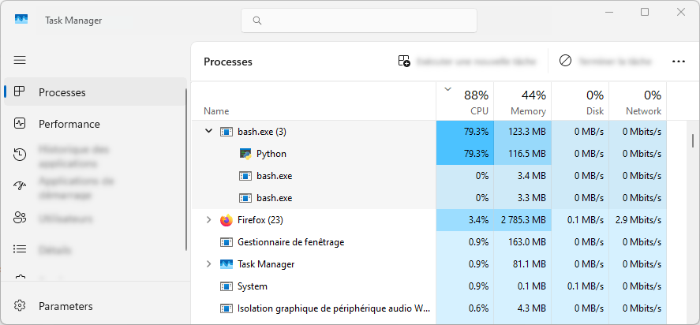

Serial jobs
===========

`Français <../../fr/task-types/serial.html>`_

There are two types of compute jobs: serial and parallel. Being able to
distinguish the two is critical to determine the resources needed for a job.

Serial jobs are those that use only a single CPU core. Conversely, parallel jobs
are able to use many cores simultaneously. A different way to put it is that, in
a serial job, all calculation steps are performed one after the other while, in
a parallel job, some steps happen simultaneously (see figure below). Serial
calculations are by far the most common.

.. figure:: ../../images/task-types_en.svg

Identifying a serial job
------------------------

How can you find out if your job is serial or parallel?

- Check your program’s documentation. If there is no mention of parallel
  computing, it probably is a serial program.
- If the program works on your personal computer, do a test: run the program and
  check how many CPU cores it uses with the help of a :ref:`task manager
  <task-manager>`.
- Do a short test on a cluster login node: run the program in the background and
  check how many CPU cores it uses with the help of the ``top`` task manager
  (or, alternatively, ``htop``). Then, stop the program to avoid overloading the
  login node.

.. _task-manager:

Using a task manager
--------------------

A task manager shows the programs running on the computer. It typically displays
the processor time and memory consumed by the most intensive programs, along
with the total load, that is the processor time and memory used by all programs.

Windows
'''''''

The `Windows Task Manager
<https://en.wikipedia.org/wiki/Task_Manager_(Windows)>`_ can be started in two
ways:

- Look for *Task Manager* in the *Start* Menu.
- Use the :kbd:`Ctrl+Alt+Del` shortcut.

.. note::

    In the Windows Task Manager, 100 % CPU usage means that all CPU cores are
    fully used. If your computer has *n* CPU cores (this information is in the
    *Performance* panel), an intensive serial program should show 100 % / *n*
    CPU usage in the *Processes* panel. For example, that would be 100 % / 4 =
    25 % on a 4-core computer.

    In the above figure, the *Python* process uses more than one CPU core since
    its usage is above 50 % on a 10-core computer. If this program had been
    serial, usage would have been around 10 %, or 100 % / 10 cores.

MacOS
'''''

The `Activity Monitor
<https://support.apple.com/en-ca/guide/activity-monitor/actmntr1001/mac>`_ can
be started in two ways:

- Look for *Activity Monitor* in *Applications* → *Utilities*.
- Use the :kbd:`⌘+Space` keyboard shortcut to show the finder, then enter the
  first few letters of *Activity Monitor* and select the application when its
  name shows up.

(Image from Apple technical support)

Linux
'''''

The ``top`` task manager is used in a terminal.

- To quit ``top``, use the :kbd:`q` key.
- ``top`` accepts several options. The following ones are used in this workshop.

  - ``-u <username>`` : Show only the processes started by a specific user.
  - ``-H`` : Show each program’s threads of execution separately. In ``top``,
    the :kbd:`Shift+h` keyboard shortcut switches between individual and
    collective display of execution threads.

.. figure:: ../../images/linux-top.png

In ``top``, 100 % CPU usage means one fully used CPU core. When an intensive
serial program is running, ``top -u $USER`` should show the process along with a
CPU usage close to 100 % :

.. code-block:: console
    :emphasize-lines: 8

    top - 18:55:40 up 121 days, 10:34,  1 user,  load average: 0,84, 0,41, 0,56
    Tâches: 1153 total,   2 en cours, 1151 en veille,   0 arrêté,   0 zombie
    %Cpu(s):  0,9 ut,  0,1 sy,  0,0 ni, 98,9 id,  0,0 wa,  0,0 hi,  0,0 si,  0,0 st
    MiB Mem : 515670,6 total, 366210,5 libr,  20660,2 util, 128799,9 tamp/cache
    MiB Éch :      0,0 total,      0,0 libr,      0,0 util. 490099,2 dispo Mem 

      PID UTIL.     PR  NI    VIRT    RES    SHR S  %CPU  %MEM    TEMPS+ COM.
    65826 alice     20   0   20272   6896   3296 R  98,3   0,0   1:39.15 python
    66465 alice     20   0   22528   3088   1344 R   1,1   0,0   0:00.03 top
    64485 alice     20   0   24280   5704   2088 S   0,0   0,0   0:00.04 bash
    65900 alice     20   0  192996   2968   1032 S   0,0   0,0   0:00.01 sshd
    65901 alice     20   0  127588   3544   1796 S   0,0   0,0   0:00.02 bash

The ``htop`` task manager is a ``top`` alternative that offers additional
features and a more sophisticated interface.

.. figure:: ../../images/linux-htop.png

Requesting appropriate resources
--------------------------------

Since a serial job can use only a single CPU core, it should not include any
parallelism options, such as ``--cpus-per-task``, ``--ntasks``,
``--ntasks-per-node`` or ``--nodes``. Here is a minimal job script example for
a serial program:

.. code-block:: bash

    #!/bin/bash

    #SBATCH --job-name=my-serial-job
    #SBATCH --mem=1G
    #SBATCH --time=4:00:00
    #SBATCH --account=def-sponsor

    ./serial-prog

To make the serial nature of a job explicit, its script can include the default
values for parallelism options:

.. code-block:: bash
    :emphasize-lines: 2,3

    #SBATCH --job-name=my-serial-job
    #SBATCH --ntasks=1
    #SBATCH --cpus-per-task=1
    #SBATCH --mem=1G
    #SBATCH --time=4:00:00
    #SBATCH --account=def-sponsor

Exercise
--------

**Objectives**

- Verify that the ``fibo`` program in the exercise directory is serial.
- Use the ``top`` task manager.
- Manage a background program with ``&`` and ``jobs``.

**Instructions**

#. Go to the exercise directory with
   ``cd ~/cq-formation-cip201-main/lab/fibonacci-serial``.
#. Compile the ``fibo`` program with the ``make`` command.
#. Start an interactive job with ``salloc --cpus-per-task=2
   --time=00:10:00``.
#. Run the program with ``./fibo 50 &``.

   #. Used as a final character, ``&`` runs a program in the background. You can
      then continue typing commands while the program runs.
   #. Show the background programs with ``jobs``.
   #. When a background program is done, a
      ``[1]+  Done...`` message is displayed.

#. While ``fibo`` runs, check its CPU usage in the task manager.

   #. Show the task manager with ``top -u $USER -H``.
   #. Quit the manager with :kbd:`q`.

#. Stop the ``fibo`` program with ``kill %1``.

   #. ``kill`` immediately terminates a program. ``%1`` identifies ``fibo``
      in the list shown with ``jobs``.

#. If you are not already back on ``login1``, end your interactive job with
   ``exit``.

.. warning::

    The ``jobs`` command used in this exercise shows the programs
    started in the background with the Bash interpreter. It does not list and
    has nothing to do with the jobs submitted to the scheduler!

.. note::

    ``fibo <n>`` computes the nth number in the Fibonacci sequence, where each
    number is the sum of the previous two:

        0, 1, 1, 2, 3, 5, 8, 13, 21, 34, 55, 89, 144, …

    This is an example of an intrinsically serial mathematical problem. Since
    each computation step is entirely dependent on the results of the previous
    steps, these steps can only be performed one after the other. No algorithm
    can compute the nth Fibonacci number in parallel.

    You can read the program’s source code in ``fibo.c``.
