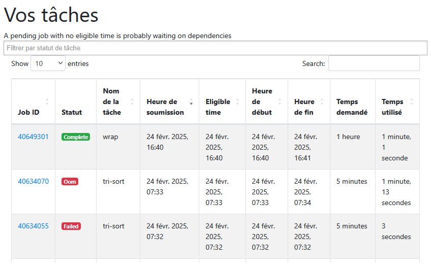
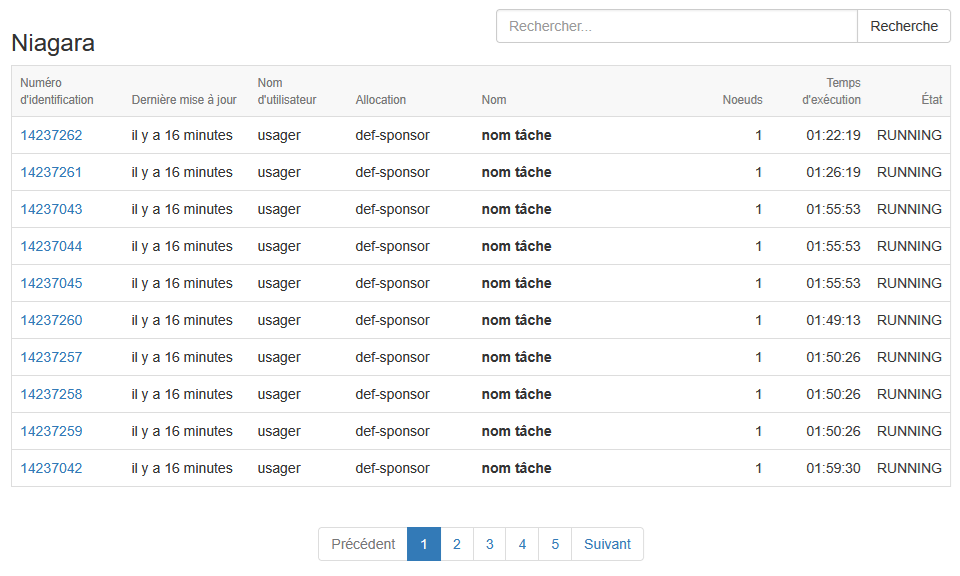

Portails des utilisateurs
=========================

`English <../en/monitoring/user-portal.html>`_

Certaines grappes de calcul offrent un portail permettant de monitorer vos
tâches en cours et même vos tâches récemment terminées. Les voici :

- **Béluga** : https://portail.beluga.calculquebec.ca
- **Narval** : https://portail.narval.calculquebec.ca
- **Niagara** : https://my.scinet.utoronto.ca

Dans tous les cas, il faut s'y authentifier avec nos identifiants du portail
`CCDB <https://ccdb.alliancecan.ca>`_.

Statistiques des tâches sur Narval
----------------------------------

Dans le portail de Narval (ou celui de Béluga), un tableau listant vos
dernières tâches se trouve dans la page
`Statistiques des tâches <https://portail.narval.calculquebec.ca/secure/jobstats/>`_,
à la section *Vos tâches*.

En cliquant sur l'un des numéros de tâche, on accède à une page affichant
toutes les informations disponibles au sujet de la tâche :

- S'il y a lieu, les modules chargés.
- S'il y a lieu, un ou des messages diagnostiques donnant des suggestions pour
  améliorer le script de tâche.
- Un bouton pour voir le script de tâche.
- Un bouton pour voir la commande de soumission.
- L'historique de la tâche.
- Un tableau résumé des ressources demandées.
- Une analyse complète des ressources utilisées (si mesurées) selon le temps :

  - Utilisation CPU.
  - Utilisation de la mémoire.
  - Nombre de processus et de fils d'exécution.
  - Les accès au système de fichiers.
  - Les ressources partagées du noeud complet :

    - Bande passante Ethernet et Infiniband.
    - Utilisation du stockage local (nombre d'opérations, bande passante,
      utilisation totale).
    - Puissance électrique utilisée.

Statistiques des tâches sur Niagara
-----------------------------------

Dans le portail de Niagara, un tableau listant vos
dernières tâches se trouve dans la page
`Tâches -> Niagara <https://my.scinet.utoronto.ca/jobs/niagara>`_.

En cliquant sur l'un des numéros de tâche, on accède à une page affichant
toutes les informations disponibles au sujet de la tâche :

- L'historique de la tâche.
- Une analyse complète des ressources utilisées (si mesurées) selon le temps :

  - Utilisation du processeur
  - Mémoire disponible
  - Débit en lecture des données
  - Débit en écriture des données
  - Opérations sur les fichiers
  - etc.

- Le script de tâche.
- Les variables d'environnement de la tâche en cours.
