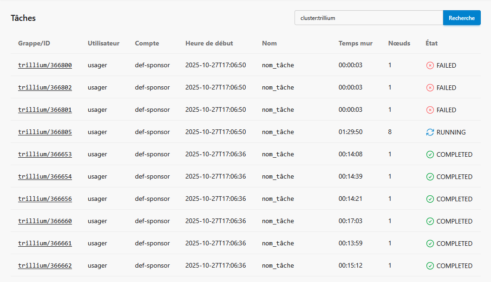

Portails des utilisateurs
=========================

`English <../../en/monitoring/user-portal.html>`_

Certaines grappes de calcul offrent un portail permettant de monitorer vos
tâches en cours et même vos tâches récemment terminées. Les voici :

- **Narval** : https://portail.narval.calculquebec.ca
- **Rorqual** : https://metrix.rorqual.calculquebec.ca
- **Trillium et Trillium GPU** : https://my.scinet.utoronto.ca

Dans tous les cas, il faut s'y authentifier avec nos identifiants du portail
`CCDB <https://ccdb.alliancecan.ca>`__.

.. note::

    Suite au `renouvellement de l’infrastructure de 2025
    <https://docs.alliancecan.ca/wiki/Infrastructure_renewal/fr>`__, toutes les
    grappes n’ont pas déjà un portail utilisateur. De nouveaux portails et
    fonctionnalités seront ajoutés progressivement.

Statistiques des tâches sur Narval
----------------------------------

Dans le portail de Narval (ou celui de Rorqual), un tableau listant vos
dernières tâches se trouve dans la page `Statistiques des tâches
<https://portail.narval.calculquebec.ca/secure/jobstats/>`__, à la section *Vos
tâches*.

.. figure:: ../../images/portal-tasks-table-narval_fr.png

En cliquant sur l'un des numéros de tâche, on accède à une page affichant
toutes les `informations disponibles au sujet de la tâche
<https://docs.alliancecan.ca/wiki/Metrix#Page_d'une_t%C3%A2che_CPU>`__ :

- S'il y a lieu, les modules chargés.
- S'il y a lieu, un ou des messages diagnostiques donnant des suggestions pour
  améliorer le script de tâche.
- Un bouton pour voir le script de tâche.
- Un bouton pour voir la commande de soumission.
- L'historique de la tâche.
- Un tableau résumé des ressources demandées.
- Une analyse complète des ressources utilisées (si mesurées) selon le temps :

  - Utilisation CPU. Dans la figure ci-dessous, 8 des 12 cœurs demandés pour la
    tâche sont utilisés à 100%.

    .. figure:: ../../images/portal-cpu-core-usage_fr.png

  - Utilisation de la mémoire.
  - Nombre de processus et de fils d'exécution. Dans la figure ci-dessous, on y
    voit quatre (4) processus utilisant chacun deux (2) fils d'exécution
    ``gmx``, donc 8 fils d'exécution bien actifs.

    .. figure:: ../../images/portal-processes-and-threads.png

  - Les accès au système de fichiers.
  - Les ressources partagées du nœud complet :

    - Bande passante Ethernet et Infiniband.
    - Utilisation du stockage local (nombre d'opérations, bande passante,
      utilisation totale).
    - Puissance électrique utilisée.

Pour d'autres images et davantage d'information, voir la `section de
documentation ici
<https://docs.alliancecan.ca/wiki/Metrix#Statistiques_des_t%C3%A2ches>`__.

Statistiques des tâches sur Trillium
------------------------------------

Dans le portail de SciNet, vos tâches récentes sont classées par grappe :

- Trillium (CPU) : https://my.scinet.utoronto.ca/jobs/?q=cluster:trillium
- Trillium GPU : https://my.scinet.utoronto.ca/jobs/?q=cluster:trillium-gpu

En cliquant sur l'un des numéros de tâche, on accède à une page affichant
toutes les informations disponibles au sujet de la tâche :

- L'historique de la tâche.
- Une analyse complète des ressources utilisées (si mesurées) selon le temps :

  - Utilisation moyenne des processeurs par nœud. Dans la figure ci-dessous,
    chaque point de couleur correspond à l'un des 8 nœuds réservés pour la
    tâche.

    .. figure:: ../../images/portal-trillium-node-usage_fr.png

  - Mémoire disponible.
  - Opérations en virgule flottante par seconde.
  - Débit des données en mémoire.
  - Débit de transfert des données via Infiniband.
  - etc.

- Le script de tâche.
- Les variables d'environnement de la tâche en cours.
