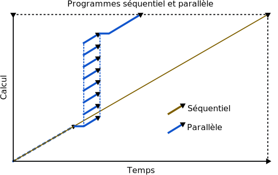

Cœurs CPU
=========

`English <../../en/resources/cpu.html>`_

Les cœurs CPU sont une ressource analysée diféremment du temps ou de la mémoire.
Pour les tâches parallèles, il faut bien sûr choisir un nombre de cœurs.
Toutefois, aussi bien pour les tâches sérielles que parallèles, il importe de
vérifier que le CPU est bien utilisé.

Pourquoi vérifier l’utilisation du CPU ?
----------------------------------------

- Les cœurs CPU alloués à une tâche ne sont pas constamment en train de
  calculer : ils attendent parfois d’obtenir les données d’un fichier, une
  réponse à une communication réseau, etc.
- Si ce temps d’attente est important, les cœurs CPU sont sous-utilisés.
- Régler ce problème accélère votre programme et évite le gaspillage de
  ressources, augmentant la priorité de vos tâches.

Vérifier l’utilisation du CPU
-----------------------------

L’utilisation CPU d’une tâche terminée peut être affichée avec ``seff``. Par
exemple :

.. code-block:: console
    :emphasize-lines: 1,6-10

    [alice@narval3 ~]$ seff 39732872
    Job ID: 39732872
    Cluster: narval
    User/Group: alice/alice
    State: COMPLETED (exit code 0)
    Nodes: 1
    Cores per node: 12
    CPU Utilized: 00:51:04
    CPU Efficiency: 70.71% of 01:13:24 core-walltime
    Job Wall-clock time: 00:06:07
    Memory Utilized: 270.59 MB
    Memory Efficiency: 8.81% of 3.00 GB

Où *CPU Utilized* est le temps CPU total utilisé par tous les cœurs et *Job
Wall-clock time* le temps réel. L’utilisation CPU de cette tâche est de 70,71 %.
Cela signifie que près de 30 % du temps CPU potentiel a été inutilisé ! ``seff``
calcule l’utilisation (:math:`U`) pour :math:`n` cœurs CPU ainsi :

.. math::

    U = \frac{t_\text{CPU}}{t_\text{réel}\;n}

Les valeurs brutes nécessaires à ce calcul peuvent aussi être affichés
avec ``sacct``. Par exemple :

.. code-block:: console
    :emphasize-lines: 1,4

    [alice@narval3 ~]$ sacct -j 39732872 -o JobID%15,JobName,Elapsed,TotalCPU,NCPUs
              JobID    JobName    Elapsed   TotalCPU      NCPUS 
    --------------- ---------- ---------- ---------- ---------- 
           39732872     gmx-md   00:06:07  51:04.301         12 
     39732872.batch      batch   00:06:07  00:01.043         12 
    39732872.extern     extern   00:06:07  00:00.001         12 
         39732872.0        gmx   00:06:05  51:03.255         12

.. note::

    Les caractères ``%15`` sont utilisés pour contrôler la largeur de la
    colonne.

Si l’utilisation CPU est inférieure à 90 %, il convient de se poser des
questions. Votre programme passe-t-il beaucoup de temps à lire des fichiers
plutôt qu’à calculer ? Y a-t-il une communication inefficace entre les cœurs CPU
alloués à une tâche parallèle ? Pour le vérifier :

* Réduisez le nombre de cœurs CPU s’il s’agit d’une tâche parallèle.
* Optimisez les accès au stockage en lisant les fichiers à partir du `stockage
  local sur les nœuds de calcul
  <https://docs.alliancecan.ca/wiki/Using_node-local_storage/fr>`__ plutôt qu’à
  partir d’un système de fichiers réseau (``/home``, ``/project``,
  ``/scratch``). Vos tâches ont accès à un répertoire temporaire local dans
  ``$SLURM_TMPDIR``.

.. warning::

    Dans la sortie de ``seff``, l’utilisation CPU est appelée *CPU Efficiency*.
    Toutefois, cette mesure est distincte de l’*efficacité* d’un programme
    parallèle, qui est une mesure de sa :ref:`scalabilité <scalability>`, tel
    que discuté dans les sections suivantes.

Exercice
''''''''

#. Affichez la liste de vos tâches avec ``sacct -X``.
#. Essayez la commande ``seff <jobid>`` pour l’une d'entre elles et vérifiez
   l’utilisation CPU.
#. Essayez ``sacct -j <jobid> -o JobID,JobName,Elapsed,TotalCPU,NCPUs`` pour la
   même tâche. Calculez l’utilisation CPU.

Pourquoi optimiser le nombre de cœurs CPU ?
-------------------------------------------

- Votre programme parallèle se terminera plus rapidement si plus de cœurs CPU
  sont alloués à la tâche.
- La performance d’un programme n’augmente toutefois pas indéfiniment avec le
  nombre de cœurs.
- En outre, les tâches qui demandent plus de cœurs attentent davantage dans la
  file et consomment plus de ressources, diminuant la priorité de vos tâches.
- Un nombre optimal de cœurs CPU balance ces effets opposés, minimisant le temps
  total (attente et calcul) pour accomplir vos tâches et évitant le gaspillage
  de ressources.

.. _scalability:

Scalabilité
-----------

La `scalabilité <https://docs.alliancecan.ca/wiki/Scalability/fr>`__ est la
capacité d’un programme parallèle à réduire le temps de calcul à mesure qu’il
utilise plus de cœurs CPU. Par exemple, idéalement, utiliser deux cœurs CPU
plutôt qu’un seul réduirait de moitié le temps de calcul et en utiliser quatre
réduirait ce temps à 1/4 du temps requis avec un seul cœur.

En réalité, toutefois, les programmes parallèles ont leurs limites. À mesure que
l’on utilise plus de cœurs CPU, le gain de temps diminue et devient
éventuellement négligeable. Certains programmes et algorithmes ont une meilleure
scalabilité que d’autres. De plus, la scalabilité varie en fonction de certains
paramètres tels que la taille des données d’entrée.

On quantifie la scalabilité avec deux grandeurs : l’accélération et
l’efficacité. Pour :math:`n` cœurs CPU, l’accélération (*speedup*, :math:`S`)
est le ratio du temps d’exécution sériel sur le temps d’exécution parallèle :

.. math::

    S_n = \frac{t_\text{sériel}}{t_n}

Par exemple, si un calcul requiert 10 minutes avec 1 cœur CPU et 6 minutes avec
2, l’accélaration est de 1,67. C’est donc une mesure de « combien de fois plus
rapide est le programme ».

L’efficacité (*efficiency*, :math:`E`) est le ratio de l’accélération sur le
nombre de cœurs CPU :

.. math::

    E_n = \frac{S_n}{n}

Poursuivant l’exemple ci-dessus, une accélération de 1,67 pour 2 cœurs CPU donne
une efficacité de 0,835 (83,5 %). Une efficacité de 100 % est qualifiée de
linéaire. Lorsque l’efficacité tombe sous 75 %, on devrait généralement diminuer
le nombre de cœurs utilisés.

Dans cet exemple de scalabilité d’un programme parallèle (voir figure
ci-dessous), on remarque un point d’inflection à 256 cœurs : l’efficacité
diminue rapidement passé ce point.

Dans cet exemple, on utilise la performance (:math:`P`) plutôt que le temps de
calcul (:math:`t`) pour illustrer la scalabilité. Les deux approches sont
équivalentes, la performance ayant simplement une dimension inverse
(:math:`t^{-1}`). La performance est exprimée avec une unité qui sied au
problème : étapes de calcul par seconde, nombre d’images ou de molécules
traitées par heure, durée de trajectoire simulée par jour, etc. L’accélération
peut être calculée à partir de la performance plutôt que du temps de calcul :

.. math::

    S_n = \frac{P_{n}}{P_\text{sérielle}}

.. _scalability-exercise:

Exercice
''''''''

**Objectifs**

- Analyser la scalabilité d’une tâche parallèle.
- Déterminer le nombre optimal de cœurs CPU à utiliser pour cette tâche.

**Instructions**

#. Allez dans le répertoire de l’exercice avec ``cd
   ~/cq-formation-cip201-main/lab/gmx-scaling``.
#. Préparer les fichiers d’entrée de la tâche avec ``bash gmx-prepare.sh``.
#. Éditez le script de tâche avec ``nano gmx-job.sh``. Demandez 1, 2, 4 ou 8
   cœurs CPU avec l’option ``--cpus-per-task``.
#. Soumettez la tâche.
#. Une fois la tâche terminée, obtenez la performance du programme avec ``grep
   ^Performance slurm-<jobid>.out``.
#. Changez le nombre de cœurs demandés et répétez la tâche. (Ne préparez pas à
   nouveau les fichiers d’entrée.)
#. Remplissez le tableau dans ``gmx-scaling.txt``.

   #. Rapportez les performances obtenues dans la colonne :math:`P` (ns/day).
   #. Calculez l’accélération :math:`S` et l’efficacité :math:`E` (%) pour 2, 4
      et 8 cœurs.
   #. Combien de cœurs CPU utiliseriez-vous pour des tâches similaires ?

.. note::

    Cette tâche calcule les interactions au sein d’une boîte périodique
    contenant 216 molécules d’eau (648 atomes, voir figure ci-dessous) avec
    GROMACS, un logiciel pour les simulations biomoléculaires.

    .. figure:: ../../images/water-box.png
        :width: 320px

    Les auteurs du programme rapportent qu’il est scalable jusqu’à environ 50
    atomes par cœur CPU. En deçà de cette valeur, la performance n’augmente plus
    même si l’on utilise davantage de cœurs. L’efficacité diminue toutefois bien
    avant d’atteindre cette limite !

    En pratique, les simulations biomoléculaires traitent des systèmes beaucoup
    plus gros, souvent de l’ordre de centaines de milliers d’atomes. Les
    programmes parallèles qui simulent ces systèmes sont efficaces même avec des
    centaines de cœurs CPU.

Pourquoi l’efficacité n’est-elle pas linéaire ?
'''''''''''''''''''''''''''''''''''''''''''''''

La scalabilité est limitée par la fraction du programme qui calcule en parallèle
(voir figure ci-dessous). C’est ce qu’on appelle la `loi d’Amdahl
<https://fr.wikipedia.org/wiki/Loi_d%27Amdahl>`__. Un programme parallèle peut
avoir une fraction sérielle pour une variété de raisons :

- Lecture non parallèle d’un fichier d’entrée ou mise à jour d’un fichier de
  sortie.
- Pré- ou post-traitement des données avant ou après l’application d’un
  algorithme parallèle.
- Une étape intermédiaire du calcul qui n’est pas parallélisée.

De plus, le temps nécessaire à la communication entre les fils d’exécution
diminue l’efficacité. Généralement, plus la taille d’un problème augmente, plus
son traitement parallèle est efficace.

Pour toutes ces raisons, la seule manière de déterminer efficacement le nombre
optimal de CPU pour une tâche parallèle est de faire une analyse de scalabilité
(voir l’:ref:`exercice <scalability-exercise>` ci-haut) et de la répéter chaque
fois que les paramètres de votre tâche ou la taille de vos données d’entrée
changent significativement.

.. note::

    On distingue la scalabilité forte (*strong scaling*) de la
    scalabilité faible (*week scaling*).
    
    - La scalabilité forte est la variation du temps de calcul en fonction du
      nombre de cœurs CPU pour un problème dont la taille *totale* est
      constante. Idéalement, le temps de calcul est inversement proportionnel au
      nombre de cœurs CPU.
    - La scalabilité faible est la variation du temps de calcul en fonction du
      nombre de cœurs CPU pour un problème dont la taille *par cœur CPU* est
      constante. Idéalement, le temps de calcul demeure constant.

.. warning::

    À nouveau, l’*efficacité* d’un programme parallèle n’est pas la même mesure
    que son utilisation du CPU. La mesure dénommée *CPU Efficiency* dans la
    sortie de la commande ``seff`` est en fait l’utilisation CPU et n’est pas
    une mesure de la scalabilité d’un programme : ``seff`` ne peut pas deviner
    et analyser automatiquement la performance d’un programme parallèle !
