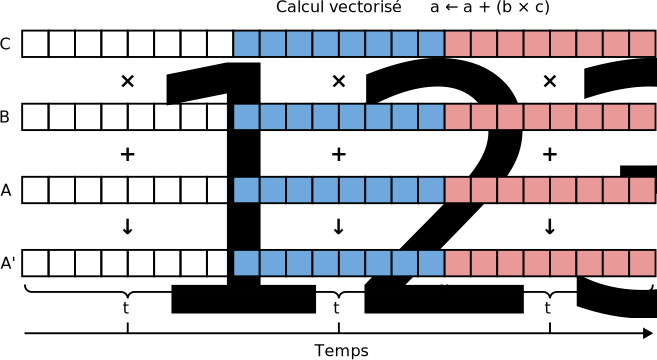

Tâches parallèles
=================

`English <../../en/task-types/parallel.html>`_

Les tâches parallèles sont celles qui utilisent plus d’un cœur CPU. Leur
objectif est de réduire le temps de calcul nécessaire. Pour ce faire, un
programme parallèle doit décomposer le calcul à l’aide d’un algorithme
parallèle, c’est-à-dire diviser la tâche en sous-tâches qui peuvent être
accomplies simultanément (voir figure ci-dessous).

.. image:: ../../images/task-types_fr.svg
    :align: center

La manière d’exécuter un programme parallèle sur une grappe de calcul varie. Les
sections suivantes couvrent les :ref:`programmes multi-fils
<para-multi-threading>` et les :ref:`programmes MPI <para-mpi>`, deux approches
fréquemment utilisées. Le cas plus complexe du :ref:`parallélisme imbriqué
<para-nested>` est ensuite présenté, avant une brève discussion des :ref:`autres
types de parallélisme <para-others>`.

Lorsque vous utilisez un programme parallèle sur nos grappes pour la première
fois, consultez avant tout la `documentation technique de l’Alliance
<https://docs.alliancecan.ca/wiki/Technical_documentation/fr>`_. Nous y
expliquons comment exécuter une variété de programmes scientifiques, incluant
des exemples de scripts de tâches. N’hésitez pas non plus à contacter notre
`soutien technique <https://docs.alliancecan.ca/wiki/Technical_support/fr>`_ si
vous avez des questions.

.. _para-multi-threading:

Programmes multi-fils
---------------------

Ces programmes créent de multiple fils d’exécution. Chaque fil (*thread*)
utilise un cœur CPU. Les fils d’exécution existent à l’intérieur du processus et
partagent le même emplacement mémoire qu’ils utilisent pour communiquer :

Les tâches de calcul qui utilisent un programme multi-fils sont limitées à un
seul nœud de calcul puisque tous les fils d’exécution existent à l’intérieur
d’un seul processus. (Nous verrons plus loin que les :ref:`programmes MPI
<para-mpi>` peuvent utiliser plus d’un nœud de calcul.)

Identifier un programme multi-fil
'''''''''''''''''''''''''''''''''

Cherchez les mots-clés suivants dans la documentation de votre programme :

- *Multi-threading*
- OpenMP : un standard pour la programmation multi-fils
- Intel MKL threads : une bibliothèque numérique supportant le parallélisme
  multi-fils
- Intel Thread Building Blocks (TBB) : une bibliothèque pour la programmation
  multi-fils
- pthreads : une bibliothèque pour la programmation multi-fils
- *Shared memory* : réfère à la stratégie de communication utilisée
  dans les programmes multi-fils

Les programmes multi-fils peuvent aussi être identifiés par leur comportement
dans le gestionnaire de tâches. Dans ``top -u $USER``, une entrée pour un
programme multi-fil intensif affichera une utilisation CPU de plus de 100 %
(environ 100 % fois le nombre de cœurs utilisés) :

.. code-block:: console
    :emphasize-lines: 2

      PID UTIL.     PR  NI    VIRT    RES    SHR S  %CPU  %MEM    TEMPS+ COM.
    65829 alice     20   0   20272   6896   3296 R 796,1   0,0   1:39.15 mt-prog
    66465 alice     20   0   22528   3088   1344 R   1,1   0,0   0:00.03 top
    64485 alice     20   0   24280   5704   2088 S   0,0   0,0   0:00.04 bash
    65900 alice     20   0  192996   2968   1032 S   0,0   0,0   0:00.01 sshd
    65901 alice     20   0  127588   3544   1796 S   0,0   0,0   0:00.02 bash

Avec ``top -u $USER -H`` (ou le racourci clavier :kbd:`Maj+h`), il y aura une
entrée pour chaque fil d’exécution :

.. code-block:: console
    :emphasize-lines: 2-9

      PID UTIL.     PR  NI    VIRT    RES    SHR S  %CPU  %MEM    TEMPS+ COM.
    65829 alice     20   0   20272   6896   3296 R  99,9   0,0   1:39.15 mt-prog
    65830 alice     20   0   20272   6896   3296 R  99,9   0,0   1:39.15 mt-prog
    65831 alice     20   0   20272   6896   3296 R  99,9   0,0   1:39.15 mt-prog
    65832 alice     20   0   20272   6896   3296 R  99,9   0,0   1:39.15 mt-prog
    65833 alice     20   0   20272   6896   3296 R  99,1   0,0   1:39.15 mt-prog
    65834 alice     20   0   20272   6896   3296 R  99,1   0,0   1:39.15 mt-prog
    65835 alice     20   0   20272   6896   3296 R  95,0   0,0   1:39.15 mt-prog
    65836 alice     20   0   20272   6896   3296 R  95,0   0,0   1:39.15 mt-prog
    66465 alice     20   0   22528   3088   1344 R   1,1   0,0   0:00.03 top
    64485 alice     20   0   24280   5704   2088 S   0,0   0,0   0:00.04 bash
    65900 alice     20   0  192996   2968   1032 S   0,0   0,0   0:00.01 sshd
    65901 alice     20   0  127588   3544   1796 S   0,0   0,0   0:00.02 bash

Demander les ressources appropriées
'''''''''''''''''''''''''''''''''''

Voici un script minimal pour une tâche parallèle utilisant un programme
multi-fils :

.. code-block:: bash
    :emphasize-lines: 4-6

    #!/bin/bash

    #SBATCH --job-name=my-multi-threaded-job
    #SBATCH --ntasks=1
    #SBATCH --cpus-per-task=8
    #SBATCH --mem-per-cpu=1G
    #SBATCH --time=4:00:00
    #SBATCH --account=def-sponsor

    ./multi-threaded-prog

Dans ce contexte, ``--ntasks`` réfère non pas à une tâche de calcul mais plutôt
au nombre de processus à exécuter. Les programmes multi-fils utilisent un seul
processus. L’option ``--cpus-per-task`` réfère au nombre de cœurs CPU que le
processus utilisera, ce qui correspond au nombre de fils d’exécution.

Les différents outils pour la programmation multi-fils n’utilisent pas les mêmes
options pour contrôler le nombre de fils d’exécution. Par exemple, les
programmes OpenMP utilisent la variable d’environement ``OMP_NUM_THREADS``. Dans
un script de tâche, on assigne à cette variable le nombre de CPU demandés à
l’ordonnanceur :

.. code-block:: bash
    :emphasize-lines: 5,10

    #!/bin/bash

    #SBATCH --job-name=my-multi-threaded-job
    #SBATCH --ntasks=1
    #SBATCH --cpus-per-task=8
    #SBATCH --mem-per-cpu=1G
    #SBATCH --time=4:00:00
    #SBATCH --account=def-sponsor

    export OMP_NUM_THREADS=${SLURM_CPUS_PER_TASK:-1}

    ./openmp-prog

Exercice
''''''''

**Objectifs**

- Déterminer les options nécessaires pour une tâche multi-fils.
- Évaluer le comportement d’un programme multi-fils à l’aide de ``top``.

**Instructions**

#. Allez dans le répertoire de l’exercice avec ``cd
   ~/cq-formation-cip201-main/lab/pi-multi-threaded``.
#. Compilez le programme ``pi`` avec la commande ``make``.
#. Démarrez une tâche interactive avec ``salloc [...] --time=00:10:00``.
   Remplacez ``[...]`` par les options de parallélisme nécessaires pour une
   tâche multi-fils et demandez 2 cœurs CPU.
#. Exécutez le programme en arrière-plan avec ``./pi 10000000000 &`` (10
   milliards de points, soit un suivi de 10 zéros).
#. Pendant que ``pi`` s’exécute, observez sa consommation CPU avec ``top -u
   $USER`` et ``top -u $USER -H``.

.. note::

    Le programme utilisé dans cet exercice calcule le nombre :math:`π` (pi), le
    ratio de la circonférence d’un cercle sur son diamètre. Pour ce faire, on
    génère un grand nombre de points au hasard dans un carré arbitraire. Pour
    chaque point, on vérifie ensuite s’il est à l’intérieur d’un cercle inscrit.
    
    .. image:: ../../images/circle.svg
        :align: center
        :width: 94px

    Le ratio du nombre de points dans le cercle inscrit (:math:`p`) sur le
    nombre total de points (:math:`n`) est aussi le ratio de l’aire du cercle
    sur celle du carré :

    .. math::
    
        \frac{πr^2}{(2r)^2} = \frac{p}{n} \quad → \quad π = \frac{4p}{n}

    Une estimation précise de :math:`π` par cette méthode, dite de Monte Carlo,
    requiert un grand nombre de points aléatoires. Pour accélérer le calcul, on
    le décompose : les points à générer sont distribués entre les cœurs CPU
    alloués à la tâche. Avec 2 cœurs, chacun génère la moitié des points, ce qui
    double la vitesse.

    Cet algorithme est un exemple de parallélisme dit « trivial » puisqu’il ne
    nécessite pratiqument aucune communication : chaque cœur CPU (:math:`i`)
    génère des points aléatoires indépendamment et compte combien d’entre eux
    sont dans le cercle inscrit (:math:`p_i`). Ces valeurs sont ensuite
    additionnées pour donner :math:`p`.

    Vous pouvez lire le code source du programme dans ``pi.c``.

.. _para-mpi:

Programmes MPI
--------------

Les programmes MPI (*Message Passing Interface*) créent de multiples processus
(*processes*). Chaque processus contient un fil d’exécution et utilise un cœur
CPU. Chaque processus a son propre espace mémoire et communique avec les autres
processus en échangeant des messages :

Les tâches de calcul qui exécutent un programme MPI peuvent utiliser plusieurs
nœuds de calcul puisque les processus peuvent échanger des messages via le
réseau qui connecte les nœuds.

Identifier un programme MPI
'''''''''''''''''''''''''''

Cherchez les mots-clés suivants dans la documentation de votre programme :

- Message Passing Interface (MPI)
- *Distributed memory* : réfère à la stratégie de communication utilisée par les
  programmes MPI

Les programmes MPI peuvent aussi être identifiés grâce aux instructions données
pour les exécuter. Ces programmes sont lancés avec les commandes ``mpirun``,
``mpiexec`` ou ``srun``. Par exemple, ``mpirun -n 8 prog`` exécutera 8 processus
du programme MPI ``prog``.

Finalement, les programmes MPI peuvent aussi être identifiés par leur
comportement dans le gestionnaire de tâches. Dans ``top -u $USER``, un programme
MPI intensif aura de multiples entrées, chacune avec une utilisation CPU de près
de 100 % (une entrée pour chaque processus) :

.. code-block:: console
    :emphasize-lines: 2-9

      PID UTIL.     PR  NI    VIRT    RES    SHR S  %CPU  %MEM    TEMPS+ COM.
    65021 alice     20   0   20272   6896   3296 R 100,0   0,0   1:39.15 mpi-prog
    65025 alice     20   0   20272   6896   3296 R 100,0   0,0   1:39.15 mpi-prog
    65027 alice     20   0   20272   6896   3296 R 100,0   0,0   1:39.15 mpi-prog
    65028 alice     20   0   20272   6896   3296 R 100,0   0,0   1:39.15 mpi-prog
    65033 alice     20   0   20272   6896   3296 R 100,0   0,0   1:39.15 mpi-prog
    65022 alice     20   0   20272   6896   3296 R  99,7   0,0   1:39.15 mpi-prog
    65023 alice     20   0   20272   6896   3296 R  99,7   0,0   1:39.15 mpi-prog
    65020 alice     20   0   20272   6896   3296 R  99,7   0,0   1:39.15 mpi-prog
    66465 alice     20   0   22528   3088   1344 R   1,1   0,0   0:00.03 top
    64485 alice     20   0   24280   5704   2088 S   0,0   0,0   0:00.04 bash
    65900 alice     20   0  192996   2968   1032 S   0,0   0,0   0:00.01 sshd
    65901 alice     20   0  127588   3544   1796 S   0,0   0,0   0:00.02 bash

Demander les ressources appropriées
'''''''''''''''''''''''''''''''''''

Voici un script minimal pour une tâche parallèle utilisant un programme MPI :

.. code-block:: bash
    :emphasize-lines: 4-5,9

    #!/bin/bash

    #SBATCH --job-name=my-mpi-job
    #SBATCH --ntasks=8
    #SBATCH --mem-per-cpu=1G
    #SBATCH --time=4:00:00
    #SBATCH --account=def-sponsor

    srun ./mpi-prog

Dans ce contexte, ``--ntasks`` réfère non pas à une tâche de calcul mais plutôt
au nombre de processus à exécuter. Les programmes MPI utilisent de multiples
processus.

Les programmes MPI devraient être exécutés via la commande ``srun``. Cette
dernière exécute le nombre de processus spécifié sur le ou les nœuds de calcul
alloués à la tâche. La commande ``mpirun`` accomplit le même rôle et peut être
utilisée pour tester un programme MPI sur nœud de connexion.

Dans l’exemple ci-dessus, les 8 processus MPI peuvent être distribués sur un ou
plusieurs nœuds de calcul, selon ce qui est disponible au moment où
l’ordonnanceur alloue les ressources. Il est souvent préférable de regrouper les
processus sur le plus petit nombre de nœuds possible :

.. code-block:: bash
    :emphasize-lines: 4-5

    #!/bin/bash

    #SBATCH --job-name=my-mpi-job
    #SBATCH --nodes=1
    #SBATCH --ntasks-per-node=8
    #SBATCH --mem-per-cpu=1G
    #SBATCH --time=4:00:00
    #SBATCH --account=def-sponsor

    srun ./mpi-prog

Dans ce nouvel exemple, les 8 processus s’exécutent sur le même nœud de calcul.
Cela évite la communication entre les nœuds, qui est plus lente que celle à
l’intérieur d’un nœud, augmentant la performance de certains programmes MPI.
Plus la communication inter-processus est importante, plus la distance entre les
processus nuit à la performance.

.. warning::

    Une tâche MPI qui demande plus d’un nœud de calcul devrait occuper tous les
    cœurs CPU de ces nœuds. Par exemple, sur une grappe de calcul dont les nœuds
    ont chacun 8 cœurs, ces options seraient appropriées :

    .. code-block:: bash

        #SBATCH --nodes=2
        #SBATCH --ntasks-per-node=8

    À l’inverse, avec les options suivantes, l’ordonnanceur aurait plus de
    difficulté à allouer des ressources à la tâche et la performance pourrait
    être moindre :

    .. code-block:: bash

        #SBATCH --nodes=4
        #SBATCH --ntasks-per-node=4

.. note::

    Un programme MPI peut être compilé pour utiliser des fils d’exécution plutôt
    que des processus multiples. Ce cas de figure est très rare et n’est pas
    traité dans cet atelier.

Exercice
''''''''

**Objectifs**

- Déterminer les options nécessaires pour une tâche MPI.
- Évaluer le comportement d’un programme MPI à l’aide de ``top``.

**Instructions**

#. Allez dans le répertoire de l’exercice avec ``cd
  ~/cq-formation-cip201-main/lab/pi-mpi``.
#. Compilez le programme ``pi`` avec la commande ``make``.
#. Démarrez une tâche interactive avec ``salloc [...] --time=00:10:00``.
   Remplacez ``[...]`` par les options de parallélisme nécessaires pour une
   tâche MPI et demandez 2 cœurs CPU.
#. Exécutez le programme en arrière-plan avec ``srun ./pi 10000000000 &``
  (10 milliards de points, soit un suivi de 10 zéros).
#. Pendant que ``pi`` s’exécute, observez sa consommation CPU avec ``top
  -u $USER`` et ``top -u $USER -H``.

.. note::

    Ce programme est une version MPI de celui présenté lors de l’exercice sur
    les programmes multi-fils : il calcule le nombre :math:`π` (pi) par une
    méthode de Monte Carlo.

.. _para-nested:

Parallélisme imbriqué
---------------------

Certains programmes ont plusieurs niveaux de parallélisme imbriqués. Par
exemple, un programme MPI peut créer de multiples fils d’exécution dans chacun
de ses processus. Cette stratégie, dite hybride, nécessite de combiner les
options de parallélisme MPI et multi-fils.

Voici un script de tâche typique pour un programme MPI et multi-fils OpenMP :

.. code-block:: bash
    :emphasize-lines: 4-6,10,12

    #!/bin/bash

    #SBATCH --job-name=my-mpi-job
    #SBATCH --ntasks=4
    #SBATCH --cpus-per-task=2
    #SBATCH --mem-per-cpu=1G
    #SBATCH --time=4:00:00
    #SBATCH --account=def-sponsor

    export OMP_NUM_THREADS=${SLURM_CPUS_PER_TASK:-1}

    srun ./mpi-prog

Tel que discuté précédemment, il est souvent préférable de rassembler les
processus MPI sur le plus petit nombre de nœuds possible. Avec un programme
hybride MPI/multi-fils, cela peut être fait avec :

.. code-block:: bash
    :emphasize-lines: 4-5

    #!/bin/bash

    #SBATCH --job-name=my-mpi-job
    #SBATCH --nodes=1
    #SBATCH --ntasks-per-node=4
    #SBATCH --cpus-per-task=2
    #SBATCH --mem-per-cpu=1G
    #SBATCH --time=4:00:00
    #SBATCH --account=def-sponsor

    export OMP_NUM_THREADS=${SLURM_CPUS_PER_TASK:-1}

    srun ./mpi-prog

Dans ``top -u $USER``, un programme hybride MPI/multi-fils aura de multiples
entrées, chacune avec une utilisation CPU de plus de 100 % :

.. code-block:: console
    :emphasize-lines: 2-5

      PID UTIL.     PR  NI    VIRT    RES    SHR S  %CPU  %MEM    TEMPS+ COM.
    65021 alice     20   0   20272   6896   3296 R 200,0   0,0   1:39.15 hyb-prog
    65025 alice     20   0   20272   6896   3296 R 200,0   0,0   1:39.15 hyb-prog
    65027 alice     20   0   20272   6896   3296 R 199,9   0,0   1:39.15 hyb-prog
    65028 alice     20   0   20272   6896   3296 R 199,7   0,0   1:39.15 hyb-prog
    66465 alice     20   0   22528   3088   1344 R   1,1   0,0   0:00.03 top
    64485 alice     20   0   24280   5704   2088 S   0,0   0,0   0:00.04 bash
    65900 alice     20   0  192996   2968   1032 S   0,0   0,0   0:00.01 sshd
    65901 alice     20   0  127588   3544   1796 S   0,0   0,0   0:00.02 bash

Le parallélisme imbriqué n’est pas limité à la stratégie hybride MPI/multi-fils.
Un autre cas commun est celui d’un programme multi-fils où chaque fil
d’exécution crée lui-même d’autres fils. Cette stratégie nécessite de régler
adéquatement le nombre de fils créés par chaque niveau de parallélisme. Par
exemple, si 8 cœurs CPU sont alloués à une tâche qui utilise deux niveaux de
parallélisme multi-fils imbriqués, le premier niveau pourrait créer 4 fils
d’exécution et le second 2, pour un total qui correspond au nombre de cœurs
(4 × 2 = 8). Par contre, si les deux niveaux créaient 4 fils, il y aurait plus
de fils (4 × 4 = 16) que de cœurs, ce qui peut ralentir la tâche. Une telle
situation peut être repérée avec ``top -u $USER -H`` :

.. code-block:: console
    :emphasize-lines: 2-17

      PID UTIL.     PR  NI    VIRT    RES    SHR S  %CPU  %MEM    TEMPS+ COM.
    65021 alice     20   0   20272   6896   3296 R 100,0   0,0   1:39.15 nst-prog
    65022 alice     20   0   20272   6896   3296 R 100,0   0,0   1:39.15 nst-prog
    65023 alice     20   0   20272   6896   3296 R 100,0   0,0   1:39.15 nst-prog
    65024 alice     20   0   20272   6896   3296 R  99,9   0,0   1:39.15 nst-prog
    65025 alice     20   0   20272   6896   3296 R  80,0   0,0   1:39.15 nst-prog
    65026 alice     20   0   20272   6896   3296 R  59,0   0,0   1:39.15 nst-prog
    65027 alice     20   0   20272   6896   3296 R  49,7   0,0   1:39.15 nst-prog
    65028 alice     20   0   20272   6896   3296 R  49,0   0,0   1:39.15 nst-prog
    65029 alice     20   0   20272   6896   3296 R  40,1   0,0   1:39.15 nst-prog
    65030 alice     20   0   20272   6896   3296 R  30,0   0,0   1:39.15 nst-prog
    65031 alice     20   0   20272   6896   3296 R  17,5   0,0   1:39.15 nst-prog
    65032 alice     20   0   20272   6896   3296 R  16,0   0,0   1:39.15 nst-prog
    65033 alice     20   0   20272   6896   3296 R  15,2   0,0   1:39.15 nst-prog
    65034 alice     20   0   20272   6896   3296 R  14,5   0,0   1:39.15 nst-prog
    65035 alice     20   0   20272   6896   3296 R  14,5   0,0   1:39.15 nst-prog
    65036 alice     20   0   20272   6896   3296 R  10,9   0,0   1:39.15 nst-prog
    66465 alice     20   0   22528   3088   1344 R   1,1   0,0   0:00.03 top
    64485 alice     20   0   24280   5704   2088 S   0,0   0,0   0:00.04 bash
    65900 alice     20   0  192996   2968   1032 S   0,0   0,0   0:00.01 sshd
    65901 alice     20   0  127588   3544   1796 S   0,0   0,0   0:00.02 bash

Lorsque le nombre de fils d’exécution est supérieur au nombre de cœurs alloués à
la tâche, chaque fil n’a pas nécessairement accès à la même quantité de temps
CPU : certains fils progresseront plus rapidement, d’autres plus lentement, ce
qui nuira à leur synchronisation. Puisque chaque cœur ne peut exécuter qu’un fil
à la fois, il y aura alternance entre les fils : les cœurs sont surchargés. La
solution la plus simple à ce problème est de désactiver un des niveaux de
parallélisme.

.. _para-others:

Autres types de parallélisme
----------------------------

Le parallélisme de données consiste à répéter une tâche sérielle ou parallèle
avec différentes données d’entrées, par exemple des images, molécules ou
séquences d’ADN. Alors que l’objectif du parallélisme dans une tâche est de
réduire le temps de calcul nécessaire à cette tâche, le parallélisme de données
vise à augmenter le débit de calcul en exécutant de multiples tâches
simultanément. Nous convrirons ce sujet en détails dans l’atelier *Parallélisme
de données sur les grappes* (CIP202).

Les processeurs graphiques (GPU) permettent des calculs massivement parallèles.
Les calculs sur GPU étant très différents de ceux sur CPU présentés ici, ce
sujet fera également l’objet d’un atelier séparé (à venir).

La vectorisation est une technique de calcul parallèle qui utilise des
instructions spécialisées du CPU pour répéter une opération mathématique sur de
multiples données d’entrées en même temps (*single instruction, multiple data*,
SIMD). Ce parallélisme n’implique pas de fils d’exécution ou de processus
multiples. À la place, le programmeur ou le compilateur optimise le programme
afin que les opérations les plus demandantes soient effectuées en parallèle
(vectorisées) à l’aide d’instructions SIMD. (Voir la figure ci-dessous pour un
exemple.)

Les logiciels disponibles sur nos grappes ont été optimisés pour utiliser les
instructions SIMD des CPU. Vous n’avez donc typiquement rien à faire pour
bénéficier de ce parallélisme. Si vous compilez vous-même un programme,
toutefois, il est possible d’ativer le support pour ces jeux d’instructions
spécialisés et ainsi obtenir de meilleures performances. Nous vous suggérons de
contacter notre `soutien technique
<https://docs.alliancecan.ca/wiki/Technical_support/fr>`_ pour obtenir de
l’aide.
