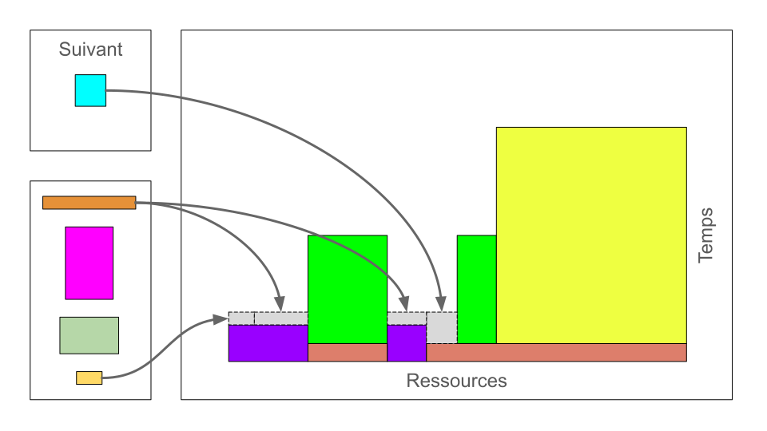

Généralités
===========

`English <../en/02-mem.html>`_

Rappel de l'ordonnancement des tâches
-------------------------------------

* Le lancement de tâches de calcul n'est pas immédiat comme sur un ordinateur
  local.

  * Les tâches sont mises en file d'attente et sont constamment triées par
    ordre de priorité en attendant que les ressources demandées soient
    disponibles.
  * Tout cela est dû à la grande demande pour les ressources de calcul.

* Selon la priorité de chaque tâche et selon les ressources qui se libèrent,
  l'ordonnanceur Slurm joue à un genre de
  `Tetris <https://fr.wikipedia.org/wiki/Tetris>`_ où chaque colonne
  de pixels est une ressource de calcul (coeur CPU ou accélérateur GPU) et où
  chaque rangée de pixels est un cycle d'ordonnancement (environ 30 secondes).

En tant qu'utilisatrice ou utilisateur des grappes de calcul, votre travail
consiste à soumettre des tâches au moyen de commandes, d'options et de
scripts de tâches.
Ces tâches seront éventuellement exécutées automatiquement.
