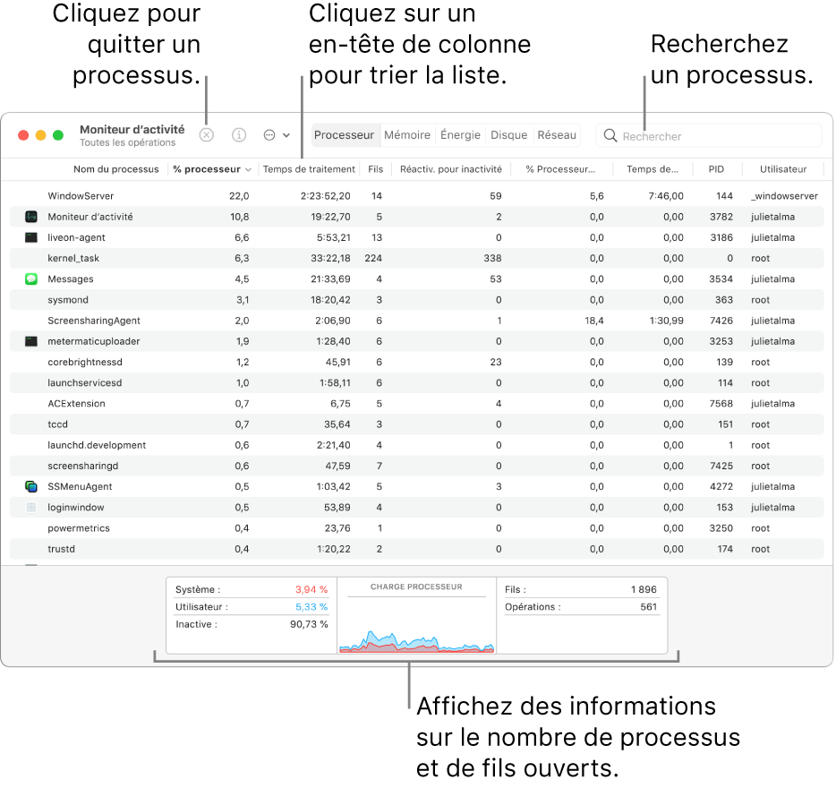
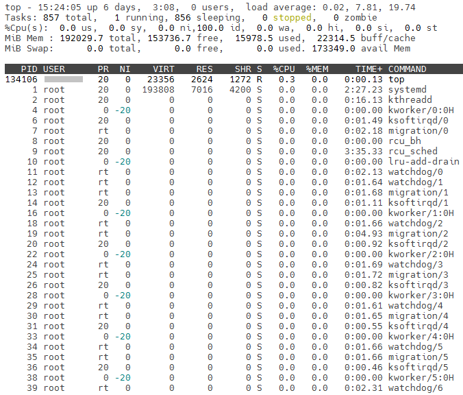

Tâches sérielles
================

`English <../../en/task-types/serial.html>`_

Il existe deux types de tâches de calcul : sérielles et parallèles. Distinguer
les deux types est crucial pour déterminer les ressources de calcul nécessaires
à chaque tâche.

Les tâches sérielles sont celles qui n’utilisent qu’un seul cœur CPU. À
l’inverse, les tâches parallèles sont capables d’utiliser simultanément
plusieurs cœurs. Une autre manière de voir les choses est que, dans une tâche
sérielle, les étapes du calcul sont toujours réalisées l’une après l’autre alors
que, dans une tâche parallèle, certaines étapes sont réalisées simultanément
(figure). Les calculs sériels sont de loin les plus communs.

Identifier une tâche sérielle
-----------------------------

Comment déterminer si votre tâche est sérielle ou parallèle ?

- Consultez la documentation de votre programme. S’il n’y a aucune mention de
  calcul parallèle, il s’agit probablement d’un programme sériel.
- Si le programme fonctionne sur votre ordinateur personnel, faites un test :
  lancez le programme et vérifiez combien de cœurs CPU il utilise à l’aide d’un
  :ref:`gestionnaire de tâches <task-manager>`. Un programme sériel intensif
  devrait avoir une consommation cœur-CPU de 100 % (un cœur, 100 % du temps).
- Faites un court test sur un nœud de connexion d’une grappe : lancez le
  programme en arrière-plan et vérifiez combien de cœurs CPU il utilise à l’aide
  du gestionnaire de tâches ``top`` (ou, alternativement, ``htop``). Interrompez
  ensuite le programme pour ne pas surcharger le nœud de connexion.

.. _task-manager:

Utiliser un gestionnaire de tâches
----------------------------------

Un gestionnaire de tâches affiche les programmes qui s’exécutent sur
l’ordinateur. Il inclut typiquement le temps processeur et la mémoire consommés
par les programmes les plus intensifs, ainsi que la charge totale, soit le temps
processeur et la mémoire utilisés par l’ensemble des programmes en cours.

Windows
'''''''

Le `Gestionnaire des tâches Windows
<https://fr.wikipedia.org/wiki/Gestionnaire_des_t%C3%A2ches_Windows>`_ peut être
affiché de deux manières :

- Cherchez *Gestionnaire des tâches* dans le menu *Démarrer*.
- Utilisez le racourci clavier :kbd:`Ctrl+Alt+Suppr`.

.. image:: ../../images/win-task-manager_fr.png

MacOS
'''''

Le `Moniteur d’activité
<https://support.apple.com/fr-ca/guide/activity-monitor/actmntr1001/mac>`_ peut
être affiché de deux manières :

- Cherchez *Moniteur d’activité* dans les *Applications et Utilitaires*.
- Utilisez le raccourci clavier :kbd:`⌘+Espace` pour afficher le champ de
  recherche, tapez les premières lettres de *Moniteur d’activité*, puis
  choisissez l’application lorsque son nom apparaît.

(Image tirée du soutien technique d’Apple)

Linux
'''''

Le gestionnaire de tâche ``top`` peut être affiché dans un terminal.

- Pour quitter ``top``, utilisez la touche :kbd:`q`.
- La commande ``top`` accepte plusieurs options. Nous verrons les suivantes
  pendant la formation.

  - ``-u <username>`` : Afficher uniquement les tâches d’un utilisateur
    spécifique.
  - ``-H`` : Afficher séparément les fils d’exécution de chaque programme.

Lors de l’exécution d’un programme sériel intensif, ``top -u $USER`` devrait
afficher le processus et une utilisation CPU de près de 100% :

.. code-block:: console
    :emphasize-lines: 8

    top - 18:55:40 up 121 days, 10:34,  1 user,  load average: 0,84, 0,41, 0,56
    Tâches: 1153 total,   2 en cours, 1151 en veille,   0 arrêté,   0 zombie
    %Cpu(s):  0,9 ut,  0,1 sy,  0,0 ni, 98,9 id,  0,0 wa,  0,0 hi,  0,0 si,  0,0 st
    MiB Mem : 515670,6 total, 366210,5 libr,  20660,2 util, 128799,9 tamp/cache
    MiB Éch :      0,0 total,      0,0 libr,      0,0 util. 490099,2 dispo Mem 

      PID UTIL.     PR  NI    VIRT    RES    SHR S  %CPU  %MEM    TEMPS+ COM.
    65826 alice     20   0   20272   6896   3296 R  98,3   0,0   1:39.15 python
    66465 alice     20   0   22528   3088   1344 R   1,1   0,0   0:00.03 top
    64485 alice     20   0   24280   5704   2088 S   0,0   0,0   0:00.04 bash
    65900 alice     20   0  192996   2968   1032 S   0,0   0,0   0:00.01 sshd
    65901 alice     20   0  127588   3544   1796 S   0,0   0,0   0:00.02 bash

Le gestionnaire `htop` est une alternative à `top` offrant davantage de
fonctionnalités et une interface plus sophistiquée.

.. image:: ../../images/linux-htop.png

Demander les ressources appropriées
-----------------------------------

Puisque une tâche sérielle ne peut utiliser qu’un seul cœur CPU, elle ne devrait
inclure aucune des options relatives au parallélisme que sont
``--cpus-per-task``, ``--ntasks``, ``--ntasks-per-node`` ou ``--nodes``. Voici
un script de tâche typique pour une tâche sérielle :

.. code-block:: bash

    #!/bin/bash

    #SBATCH --job-name=my-serial-job
    #SBATCH --mem=1G
    #SBATCH --time=4:00:00
    #SBATCH --account=def-alice

    module load python/3.11.5

    python script.py

Pour expliciter la nature sérielle d’une tâche, son script peut inclure les
valeurs par défaut des options pour le parallélisme :

.. code-block:: bash
    :emphasize-lines: 2,3

    #SBATCH --job-name=my-serial-job
    #SBATCH --ntasks=1
    #SBATCH --cpus-per-task=1
    #SBATCH --mem=1G
    #SBATCH --time=4:00:00
    #SBATCH --account=def-alice

Exercise
--------

**Objectif :** Vérifiez que le programme ``fibo`` dans le répertoire des
exercises est sériel.

#. Allez dans le répertoire de l’exercise avec
   ``cd ~/cip201-exercices/fibonacci-serial``.
#. Compilez le programme ``fibo`` avec la commande ``make``.
#. Lancez le programme sur le nœud de connexion avec ``./fibo 50 &``.

   #. Le caractère final ``&`` exécute un programme en arrière-plan. Vous pouvez
      alors taper de nouvelles commandes pendant que le programme s’exécute.

   #. Affichez les programmes en arrière-plan avec ``jobs``.

   #. Quand un programme en arrière-plan est terminé, un message
      ``[1]+  Fini...`` apparaît.

#. Pendant que ``fibo`` s’exécute, observez sa consommation de CPU dans le
   gestionnaire de tâches.

   #. Affichez le gestionnaire avec ``top -u $USER``.
   #. Quittez le gestionnaire avec :kbd:`q`.

#. Interrompez le programme ``fibo`` avec ``kill %1``.

   #. ``kill`` termine immédiatement un programme. ``%1`` identifie ``fibo``
      dans la liste affichée avec ``jobs``.

.. warning::

    La commande ``jobs`` utilisée dans cet exercise affiche les programmes
    lancés en arrière-plan avec l’interprète de commande Bash. Elle n’affiche
    pas et n’a rien à voir avec les tâches soumises à l’ordonnanceur !

.. note::

    Le programme ``fibo <n>`` calcule le nième nombre dans la suite de
    Fibonacci, où chaque nombre est la somme des deux précédents :

        0, 1, 1, 2, 3, 5, 8, 13, 21, 34, 55, 89, 144, …
    
    C’est un exemple d’un problème mathématique intrinsèquement sériel. Puisque
    chaque étape du calcul dépend entièrement du résultat des étapes
    précédentes, les étapes ne peuvent s’exécuter qu’une après l’autre. Aucun
    algorithme ne permet de calculer le nième nombre de Fibonacci en parallèle.

    Vous pouvez lire le code source du programme dans ``fibo.c``.
